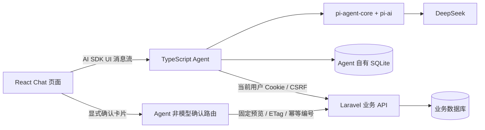

# 排课系统 AI 助手：Chat + TypeScript Agent + pi + DeepSeek

日期：2026-09-21。状态：独立 Chat 首版已实现；已修复任教课程丢失和学期上下文混淆，并完成真实 DeepSeek 的 8 个合成数据对话场景评测。

## 1. 架构与职责

- React：独立 `/ai`、`/ai/:conversationId` 页面，历史、文本流、查询来源、补充问卷、规则确认和中断重试。
- Agent：会话存储、上下文、pi 循环、DeepSeek、业务工具、流协议适配、待确认操作。
- Laravel：身份、角色、业务查询、预览、原子写入、ETag 和审计；原自动排课队列继续承担业务职责。

DeepSeek 密钥仅在 Agent 服务端。Laravel 无模型 SDK、模型密钥、AI 队列或 AI 数据表。Agent 不直连业务数据库，不读取 APP_KEY 或 sessions 表。无用户 AI 配额、计费或扣减机制。

## 2. 已交付的体验和范围

主导航「AI 助手」打开完整聊天页面。支持一般问题、写作、多轮追问；业务数据按需查工具。新对话可带当前学期，但普通问答无学期也可用。模型可通过业务上下文查询其他学期，日期问题先确认日期。

AI 页面使用专用骨架屏：初始化阶段按路由区分新对话（居中的标题、输入框和工作示例）与已有会话（顶部消息、底部输入框），对话列表按实际 256px 宽度和 36px 行高占位，不显示通用页头或大卡片。AI 路由独立设置 Suspense，页面模块加载时保留已经就绪的工作区侧栏。历史列表请求期间显示标题行占位；会话详情加载仍延迟 160ms 显示消息骨架，快速返回时不闪出加载内容。

新对话先显示本地起始页面：一句「今天想处理什么？」、居中的输入框，以及日常查询、排课检查、通知起草三行工作示例。工作示例使用小图标、名称和灰色说明，悬停时显示浅色背景；点击只填入可编辑草稿并聚焦输入框。输入或选择示例时保持居中，只有发送第一条非空消息后才收起示例、将同一个输入框平滑移到底部，并请求创建服务端会话；减少动态效果时直接切换布局。窄屏示例说明换行，低高度窗口允许起始区域滚动。

空白对话中重复点击「新对话」仅聚焦输入框，不重新跳转、创建会话或清空草稿；从已有消息的对话进入新对话时直接展示起始页面。首次创建成功后替换地址，同时保留聊天组件和客户端会话标识，避免重新挂载打断流式输出。创建失败恢复居中的起始页面并保留输入以便重试；停止或离开页面时取消尚未完成的创建与发送请求。

历史列表每页 50 个对话，消息每页 30 轮，可加载更早内容。空对话不进入历史列表。会话列表宽 256px，列表左右留白 6px、条目左右内边距 10px；选中项以背景区分，不加粗标题。桌面端会话行高 36px、条目间距 2px，标题与操作图标垂直居中；窄屏保留 48px 最小点击高度。会话行悬停或键盘聚焦时显示省略号，菜单提供重命名和删除；触屏常驻显示操作入口。长标题不使用文本省略号，右侧以渐变消失；操作入口隐藏时标题使用整行可用宽度，悬停、聚焦或打开菜单后才为操作入口留出空间，并按实际可用宽度重新计算渐变与滚动距离。鼠标悬停后短暂停顿，再通过浏览器原生 transform 动画以走马灯形式单向循环移动，保留亚像素位移，不逐帧修改滚动位置；起停平滑过渡，末尾停留后直接复位到开头，短暂停顿再正向播放，不倒放；移开鼠标平滑归位。渐变宽度与位移动画使用同一时间轴连续变化，不通过逐帧 JavaScript 或布尔开关切换边缘遮罩。操作入口显隐时可用宽度平滑过渡，尺寸稳定后从当前位置重新计算移动，不跳回起点。渐变只出现在仍有隐藏文字的一侧，短标题完整显示且不滚动。滚轮与方向键没有额外的标题操作，减少动态效果时不播放走马灯。重命名使用简洁弹窗，支持 1—80 个字符的单行名称；输入框右侧提供自动重命名图标，复用 AI 标题接口的预览模式，生成成功后只填入输入框，允许继续编辑，用户点击保存才更新会话标题；取消不保存，失败保留输入并可重试。预览不写入标题或 title_request，不触发列表更新。生成期间显示忙碌状态并防止重复提交。编辑名称不跳转会话，也不改变聊天 revision 或历史排序。

首次消息被接收后，先截取消息作为临时名称，同时独立调用已配置模型生成简短标题；关闭思考、不提供工具，标题请求最多等待 15 秒，不阻塞或限制正文与工具循环。生成期间原名称显示 shimmer，结果通过临时会话事件和列表同步原位更新。命名服务只读取用户消息，每条最多取 1,200 个字符，不发送数据库标识、工具结果或内部推理。生成失败保留原名，自动命名不自动重试，用户可在重命名弹窗自行编辑。每次生成有独立请求标识，手动编辑或删除使旧标识失效，迟到的结果不能覆盖新名称。

删除设置 deleted_at，保留会话、消息和规则操作记录；列表排除已删除会话，旧链接及读写接口也拒绝访问。删除会取消该会话正在运行的回复及标题请求，完成回调不会使其重新出现在列表。删除当前打开的会话返回新对话，删除其他会话不改变当前阅读位置。已有保存操作结果尚待确认时，需要先完成原卡片的确认，再移除对话。

首次读取未缓存的会话时保留历史列表与输入框布局，仅在消息区域加载；超过 160ms 才显示读取提示，失败也在原位置提供重试。读取期间禁用发送，离开会话取消未完成的读取请求。数据到达后在绘制前一次性恢复消息及历史文本快照，历史回复不播放入场或逐字动画。

规则页和失败任务页的入口仅预填聊天输入框，不自动发消息。支持三类规则草稿：教师禁排时段、课程偏好时段、教师每日课时上限。修改要求会重新预览，旧卡片失效。只有点击确认才保存草稿，不能直接启用。

暂未接入联网搜索、附件、资料导入、复杂调课执行、发布正式课表或跨会话长期记忆。可以讨论这些问题，不能声称完成未接入的操作。

## 3. UI 组件与流协议

Questionnaire 使用 [Base UI / base-rhea 组件](https://ui.shadcn.com/docs/components/base/questionnaire)，底层为 `@shadcn/react`。通用 Message Scroller 保留在 UI 目录；聊天页使用专门的 `ChatScroller`，在 ResizeObserver 回调中于绘制前修正滚动位置，支持稳定消息 ID、流式跟随、滚回最新和历史前插保位。用户向上滚动、选择文字时暂停自动跟随；新提问恢复跟随。所有消息始终按实际内容高度自然排列，新提问接在上一轮后面，生成、过程折叠和文字播放阶段不额外保留整屏空间，结束时也没有占位释放。内容不足一屏时保持顶部位置；只有实际内容超出视口时才滚动跟随到底部。自动跟随仅在目标位置变化时设置滚动位置，避免短回复因生成状态切换而整段上下移动。打开会话时同样遵循短内容置顶、长内容显示最新消息的规则。

「滚动到最新消息」按钮沿用 shadcn Message Scroller 的位移、缩放与透明度过渡（出现 200ms、消失 400ms），保留圆形磨砂外观。点击使用原生平滑滚动，到达后恢复流式跟随；滚动途中隐藏按钮并暂停即时跟随，避免内容更新打断动画。用户滚动、触摸或键盘操作可中断，减少动态效果时直接定位。

前端 `@ai-sdk/react` 的 `useChat` 和 `ai` 的 `DefaultChatTransport` 负责消息状态与 SSE。服务端显式将 pi 的文本、工具进度、来源、问卷、规则和诊断结果映射为 AI SDK UI message stream v1；pi 是唯一模型与工具循环。[AI SDK 传输](https://ai-sdk.dev/docs/ai-sdk-ui/transport)、[流协议](https://ai-sdk.dev/docs/ai-sdk-ui/stream-protocol)

用户提供的 [AI SDK helper](https://ui.shadcn.com/docs/helpers/ai-sdk) 是构造模拟聊天的辅助工具，不负责真实模型调用。此实现的浏览器测试直接提供确定性协议流，不将该 helper 当作后端。

过程说明直接透传模型正文增量，最终答复透传模型结构化工具参数中的 answer 增量，不等待完整模型响应。前端根据实际片段的到达速度调整显示速率，用到达时间约束每批文字的等待时间，显示延迟预算为 420ms；慢速小片段尽快展示，大段突发内容分批呈现，不再每帧显示固定比例的剩余文字。中文优先按词边界、emoji 按字素边界显示，大批文字优先按句子和换行分段，并保留已完整收到的短 Markdown 行内结构。服务端完成事件不清空显示队列，也不触发全文跳出；这些显示预算不限制模型生成时间或工具调用。刷新和前插历史直接显示完整文字，恢复中的消息只对新增文字渐进显示。减少动态效果或页面在后台时直接展示已收到文本。Markdown 不接受原始 HTML，不自动加载模型给出的图片。UI 不展示内部思考、密钥、Cookie 或原始 SDK 事件。规则/问卷卡片须完整校验且持久化成功后才发给浏览器。

正文和工具步骤按消息流中的原始顺序穿插显示，刷新后沿用已保存的顺序。单个工具步骤直接显示；只有连续的多个步骤合并为可折叠的一组，正文会分开前后两组。正在执行的工具文字使用 [shadcn shimmer](https://ui.shadcn.com/docs/utils/shimmer)，直接复用已导入的 `shadcn/tailwind.css`；保持文字双层节点和工具组节点稳定，完成时交叉淡出 shimmer，再停止动画，避免频繁卸载造成闪烁；尊重系统的减少动态效果设置。

每段文字通过 `data-text-phase` 标明文本序号和 `unknown/commentary/final_answer`。DeepSeek 没有原生消息阶段字段，因此使用独立的 `finish_answer({answer})` 控制工具。普通正文就是过程说明；模型自行组织最终答复并单独调用此工具。Agent 收到该工具名称便先通知 final_answer 阶段，随后逐段读取 pi 解码后的 answer 参数。参数 JSON、控制工具名称和确认回执不显示在页面；不使用业务关键词或正文前缀猜测最终答复。旧前缀只用于兼容已有历史，不再决定新回复阶段。

控制工具只改变交付方式，不决定答案、不限制业务查询次数。若模型正常结束但漏用交付工具，pi 通过一次内部提示让模型提交已有答复，并仅在这次交付修复请求中关闭推理、指定 finish_answer；不会按轮次强制收尾。普通研究请求仍保留完整业务工具和原推理设置。最终答复工具不能与业务工具混在同一批调用，参数须完整有效；截断、失败、中断或身份失效时撤销 final_answer 阶段，保留已输出文字，不误报成功。规则/问卷等结果仍通过原终止工具交付。

运行时展开过程；收到 final_answer 阶段便启动高度过渡。最终答复组件提前挂载并暂停显示，折叠完成后开始呈现，即使期间已经接收完全文也经过同一显示队列；新回复与历史回复根据本次打开页面的快照区分，不依赖模型是否仍在生成。折叠过渡结束事件释放正文显示，保留计时兜底和减少动态效果的即时路径。点击用时旁的箭头可展开完整过程，后续结束事件不重置手动选择。分割线始终紧跟用时行，最终答复和结果卡片在过程区域外；复制回答优先复制最终文字。中断、缺少明确最终答复或等待问卷/规则确认时保留过程；若截断后模型重答成功，旧片段作为过程保留，不阻止新最终答复收起过程。展示阶段与完整过程一并保存，刷新默认收起明确完成的过程；无法确认阶段的旧记录保留全文。

`data-activity` 在服务端区分 waiting、thinking、responding、tool。前端将等待服务响应、模型推理、准备工具参数统一显示为 shimmer 的“正在思考”；工具执行使用工具名称的 shimmer，正文输出时不显示额外等待提示。短于 160ms 的状态切换不显示提示，减少闪烁。最终答复、停止、失败或等待用户操作时移除活动提示；内部推理内容不发送到页面。

交互参考 MiMo Code 开源 UI 的相邻工具分组、分段文本呈现、双层 shimmer 和绘制前滚动修正；本项目按 React 与 pi 事件实现。Codex 的 commentary/final_answer 是显式阶段协议，不能从其开源 CLI 仓库推断闭源桌面 UI 的完整实现。

## 4. Agent HTTP 契约

所有对话接口都验证当前 Laravel 用户、同源请求与 CSRF。历史读取以 GET 调用，校验 Origin 或同源 Referer；浏览器须保留 Referer 并传 X-XSRF-TOKEN。

| 方法与路径                                                   | 作用                                                    |
| ------------------------------------------------------------ | ------------------------------------------------------- |
| `GET /agent/health`                                          | ready / unconfigured；不发模型请求                      |
| `GET /agent/v1/conversations?offset=0`                       | 当前用户的历史列表                                      |
| `POST /agent/v1/conversations`                               | `{semester_id: number \| null}` 新建会话                |
| `GET /agent/v1/conversations/:id?before=:seq`                | 分页读取消息及当前 revision、busy                       |
| `PATCH /agent/v1/conversations/:id`                          | `{title}` 手动重命名，取消旧的标题生成请求              |
| `POST /agent/v1/conversations/:id/title`                     | 空对象，独立生成并保存 AI 标题                          |
| `DELETE /agent/v1/conversations/:id`                         | 软删除，保留记录并停止该会话的运行请求                  |
| `POST /agent/v1/conversations/:id/messages`                  | `{message_id, revision, text, answer?}`，返回 UI 消息流 |
| `POST /agent/v1/conversations/:id/actions/:actionId/confirm` | 空对象，确认服务端已保存的不可变预览                    |

`answer` 是 `{question_id, values: {[questionItemId]: string[]}}`。服务端从原问题查找选项标签，校验问题 ID、选项、单/多选、自由输入权限和会话归属；不信任浏览器生成的答案说明。默认选项不视为已提交。

客户端不能传 user_id、角色、模型配置、任意工具或完整 assistant/tool 历史。消息 UUID 和 revision 拦截重复提交及多标签页的过期请求；同一会话同时只允许一个生成或保存操作。冲突后刷新对话，不静默重放旧请求。

原有 `/agent/v1/runs` 单任务接口保留兼容，但新页面不调用它；原始场景校验复用在 Chat 工具里。

## 5. pi 与业务工具

锁定 `@earendil-works/pi-agent-core`、`@earendil-works/pi-ai` 为 `0.86.1`。`createModels()` 注册 `deepseekProvider()`，`Agent.streamFn` 调用 `models.streamSimple()`；默认 `deepseek-flash`，服务端验证模型目录。Chat 默认最高思考强度 `max`，可通过 `DEEPSEEK_THINKING_LEVEL` 配置为 `off/low/high/max`；不支持推理的模型关闭思考。思考过程不发送到页面，回答仍按文本增量流式显示。Chat 与兼容场景入口单次模型请求的输出额度由 `DEEPSEEK_MAX_TOKENS` 控制，默认 `393216`（DeepSeek 官方 384 × 1024），供推理与答复共享；SDK 根据剩余上下文继续缩减额度；无网络层自动重试，pi 可在收到截断工具结果后重新提交完整参数。工具调用不设次数上限，整轮对话也不设固定超时；pi 持续查询直到模型完成回答，或工具产生需要用户操作的结果。用户停止、断开连接、身份失效、服务关闭或无法继续的错误会结束执行；单次业务网络请求保留 15 秒超时。不存在按查询轮次强制收尾的附加模型请求；缺少 finish_answer 时的格式修复只负责交付已经完成的答复。

教师的基础任教课程来自资源 API 的 `courses`；同时保留课程简称、教室用途、班级年级和状态等业务字段。资源解析使用透传结构，避免只声明 `id/name` 后静默丢掉关联资料。教师、课程、教室、年级查询不要求学期。工号允许为空；教师课程字段缺失时保留其余有效资料并标记缺口，不补成空数组。

`model-data.ts` 是业务工具与模型之间的统一边界。业务请求仍使用数字 ID，模型使用带对象类型的临时引用；引用必须来自服务端已取得的记录，校验通过后才转回 ID。已选学期由服务端默认填入，模型可以查询其他学年、学期并选择其引用。无业务用途的主键、ETag、修订号、请求标识和内部快照不进入新工具结果。引用映射保存在服务端历史的 `details` 中，每次发送模型请求前显式剔除，历史裁剪后失效的引用需要重新查询。业务名称、工号、日期、状态及业务版本序号继续保留。

结果统一携带 `data_state` 与 `coverage`：`available` 表示该次范围内的数据可用，`empty` 表示该范围没有匹配记录，`partial` 表示有未读取页面或缺失字段，`unavailable` 表示本次未能获得有效数据。`coverage.complete`、`missing_fields` 和分页总数说明本次返回范围，不表示系统所有信息齐全。字段缺失、空列表、关联为 `null` 和查询失败分别处理。不可用响应保留错误代码与安全说明，并在进度中标记失败；上游异常对象不进入模型上下文。

`chat-prompt.ts` 使用通用工作原则和显示阶段协议：学校事实来自工具、分清已知与未知、篇幅适当、语气务实、必要时澄清，不固定业务问题的查询顺序或回答句式。字段语义和覆盖范围放在工具描述及结果中，模型自主选择查询、理解问题并生成回答。运行时提供实际模型身份；同名是否影响回答由当前任务决定，需要选定对象时才澄清。

| 工具                          | 真实数据或行为                                       |
| ----------------------------- | ---------------------------------------------------- |
| `get_context`                 | context、学年、学期与 Asia/Shanghai 服务器时间       |
| `list_academic_years`         | 全部学年的名称、日期与状态                           |
| `list_semesters`              | 指定学年的全部学期                                   |
| `find_resources`              | 教师/课程/班级/教室/年级；状态、关系筛选与分页       |
| `list_class_settings`         | 按班级名称分页读取学期固定教室与班主任               |
| `query_timetable`             | 普通周或实际日期课表，筛选教师/班级/教室             |
| `list_teaching_assignments`   | 按教师、课程、班级、年级、教学组、教室及状态查询任课 |
| `list_teaching_groups`        | 教学组、组成班级及年级、任课数量和状态               |
| `list_fixed_placements`       | 固定排课要求、课节、教室、周次及锁定情况             |
| `list_teacher_leaves`         | 按教师、时间和状态查询请假                           |
| `get_teacher_leave`           | 请假明细、代课及受影响课节                           |
| `list_calendar_exceptions`    | 临时调课、换人、换教室、停补课与活动记录             |
| `list_long_term_changes`      | 长期调整、生效范围、恢复状态及通知回执               |
| `list_effective_timetables`   | 课表版本的生效区间                                   |
| `list_timetable_versions`     | 课表版本名称、序号、状态、来源及课节数量             |
| `compare_timetable_versions`  | 两个版本的差异汇总与分页明细                         |
| `get_school_settings`         | 系统登记的学校信息和业务设置                         |
| `get_semester_summary`        | 学期准备进度、业务数量和排课概况                     |
| `list_constraints`            | 分页查询规则及状态                                   |
| `get_preparation_check`       | 当前准备检查                                         |
| `list_schedule_runs`          | 按最新优先、状态筛选、分页查询任务                   |
| `get_schedule_run`            | 任务信息、分页诊断和历史规则，以及是否过时           |
| `present_explanation`         | 引用有效 evidence_id 生成说明与待验证建议            |
| `get_schedule_template`       | 完整作息，包含休息时段及停用日期、课节               |
| `get_constraint_capabilities` | Laravel 声明的三类规则能力                           |
| `prepare_rule_drafts`         | 通过 Laravel 校验并预览，不能写入                    |
| `ask_user`                    | 生成 1–3 个结构化问题并结束本轮                      |

工具只封装固定路径，不提供终端、文件、SQL、通用 HTTP 或保存工具。每次工具执行重新验身份。查询结果保留业务字段、查询范围和分页信息，超过单次输出上限明确返回不可用及原因，不把截断数据当全量。模型据此决定缩小范围、翻页或说明缺口。当前运行状态和历史诊断分开处理。

实际日期课表通过 Laravel daily-timetable 获取，业务端已叠加长期调整、临时调课、请假和代课。Agent 按实际参与教师/班级/教室筛选，不用全校总数回答单个教师的问题。普通周不能代表某天实际安排。

班级固定教室与班主任读取 Laravel class-settings，保留班级及年级、固定教室及用途、班主任、状态和分页信息。关联为 `null` 表示该项未配置，关联字段缺失则标记资料不完整。固定教室是学期配置，独立于是否已排课；如何检索和结合这些事实由模型判断。

规则前必须读取作息和能力，并唯一确认资源，这些是服务端业务守卫。作息完整返回日期开关、时段用途和授课属性，模型通过实际时间理解范围，用课节引用准备预览。未支持的需求以结构化字段返回，由模型自行说明或澄清；不再生成固定的解释话术。预览有效表示可表达、可保存，不保证整体一定可排。

任务列表返回概况，通过 `detail_sections` 和 `coverage.deferred_fields` 明确标注另行读取的诊断、历史规则快照。`get_schedule_run` 提供这些详情并保留 `is_stale`，避免把旧任务依据当作当前状态；Chat 可以读取各状态的任务，兼容入口仍只接受失败任务的解释请求。

诊断和历史规则快照不再只取前若干个字段或跳过长内容，全部按数据边界拆分，长文本标记片段位置，再按页提供。解释卡片只能引用已经读取的 `evidence_id`，事实由服务端填入，解释中的阿拉伯数字须出现在对应事实中。标题和说明由模型生成；工具解释 `NO_FEASIBLE_SOLUTION` 的含义为“搜索未找到完整解”，不能据此证明数学意义上的无解。自然语言推断仍需复核。

## 6. 会话持久化与确认状态

Agent 自有 SQLite 包含 conversations、turns、actions。每轮保存用户消息、可见助手消息、pi 工具交换和运行状态；模型上下文仅从服务端读取。Cookie、CSRF 和 API Key 不进入存储。

现有 SQLite 库启动时原位补充 conversations 的 deleted_at、title_request 及 turns 的 diagnostics_json 字段，不重建历史记录。title_request 只用于生成状态与并发覆盖校验，不复用聊天 revision；服务重启后清理未完成的标题请求标识并保留已保存名称。

文本及工具进度每约 300ms 检查点保存，中断时再保存一次；模型请求与工具执行的起止状态、已完成 pi 消息独立即时保存。成功或失败都保留完整 transcript，diagnostics_json 记录每次模型请求的标准/原始停止原因、token 用量、耗时、首事件耗时、实际额度及工具执行耗时。推理 tokens 是输出的子集，不重复累加；缺失用量为 null，整轮 usage_complete 标识是否所有请求均返回用量。内部推理、工具明细和服务商原始错误不通过 UI 接口返回。异常重启标记 AGENT_RESTARTED，未收到的用量和真实结束时间不补造；进程异常退出后恢复最近检查点，并将运行轮次标为 interrupted。前端主动停止会取消模型请求。刷新后若另一页面仍在执行，会同步状态；不重新发模型请求。

停止和失败信息随对应回复展示，不在输入框上方保留中断提示条。取消后的回复在顶部用时行显示「已在 … 后停止」，保留已生成的内容，最新中断回复可通过消息操作区的重试图标重新提问。服务端保存结构化错误码，前端兼容旧记录与缓存中的已知停止提示；真正失败时在回复内显示原因，请求尚未形成回复或同步失败时仍在输入框旁提供恢复操作。取消既可能来自主动停止，也可能来自连接断开，因此不会一律表述为用户主动停止。

最新回复结束后，有可复制文字时复制按钮常驻，中断回复的重试图标与其同时显示；不会因复制按钮透明但占位而只留下偏右的重试图标。历史回复的复制按钮与消息时间仍按原有悬停规则显示。手动收起尚无最终答复的中断过程时，过程文字随之收起，点击用时行可重新展开。

模型上下文最多保留最近 20 个已结束轮次、约 60,000 字符。中断轮次保留已返回的调用/结果对，去除截断的模型消息、没有结果的调用和孤立结果，并补充中断原因；不再把成功查询一概描述成“未完成任何操作”。单轮超过 24,000 字符时先省略历史推理，再超限才用该轮用户要求及可见回复的受限摘要替代整个工具交换；当前执行中的推理和工具交换不受此历史压缩影响。超过总上限的旧轮次从本次模型上下文剔除，完整历史仍可在 UI 分页读取。旧事实需要重新查询；这不是无限记忆。

问卷持久化后结束流。答案提交开启下一轮；直接发送新话题会取消旧问卷。不存在跨 HTTP 的长期等待。

规则状态：pending → confirming → saved；新要求或确定的过期/无效业务响应使未保存规则 expired。确认路由读取服务端存储的预览，不接收浏览器替换的 constraints、ETag 或幂等编号。保存结果不确定时保留 confirming，用户只能重试同一笔操作或等待其结果，不生成新编号重复保存。

首版 SQLite 仅支持单 Agent 实例。启动时恢复中断轮次，生产不可对同一文件运行多个 Agent；共享存储与分布式锁属于后续部署扩展。

## 7. Laravel 业务契约与写入保障

这些都是业务接口，不调用模型：

- `POST /api/v1/auth/session-check`：Sanctum 会话、CSRF、auth_version、账号状态和改密要求校验。
- `GET /semesters/{semester}/scheduling-constraints/capabilities`：可表达的业务规则。
- `POST /semesters/{semester}/scheduling-constraints/preview`：验证 1–10 条规则，返回规范化内容、可读摘要和 ETag，不写库。
- `POST /semesters/{semester}/scheduling-constraints/bulk`：显式确认后按 `If-Match` 和 UUID `Idempotency-Key` 原子创建草稿。

以上业务路径除 session-check 外也以 `/api/v1` 开头。仅 admin/scheduler 可用助手。确认时 Laravel 再执行 WriteGuard：校验当前权限、学期、业务版本。批量全部成功或全部回滚，source=user、status=draft，审计逐条记录，版本统一递增。

operation_receipts 是通用业务幂等回执。同用户、学期和操作编号相同且内容相同，重复请求返回原结果；同编号不同内容返回冲突。发生不确定网络结果时沿用原编号恢复。

## 8. 代码位置与运行

| 路径                                                         | 作用                                           |
| ------------------------------------------------------------ | ---------------------------------------------- |
| `apps/agent/src/chat-http.ts`                                | Chat HTTP、身份、流适配、确认代理              |
| `apps/agent/src/chat-store.ts`                               | SQLite、归属、版本锁、恢复、分页和待确认操作   |
| `apps/agent/src/chat-title.ts`                               | 独立标题生成、短请求、取消与旧结果保护         |
| `apps/agent/src/chat-run.ts`                                 | pi 多轮上下文、普通文本、工具事件和中断        |
| `apps/agent/src/chat-prompt.ts`                              | 回答风格、业务语义、实际模型身份               |
| `apps/agent/src/model-data.ts`                               | 模型数据边界、对象引用、技术字段过滤和覆盖范围 |
| `apps/agent/src/resource-lookup.ts`                          | 完整基础资料与课程关系、分页和唯一匹配         |
| `apps/agent/src/diagnostic-data.ts`                          | 完整诊断的递归分段，供工具分页读取             |
| `apps/agent/src/chat-tools.ts`                               | Chat 业务查询及原场景能力复用                  |
| `apps/agent/src/tools.ts`                                    | 三种规则的预览守卫、诊断证据校验               |
| `packages/agent-contracts/src/index.ts`                      | 请求、问卷、卡片和 UI 消息类型                 |
| `apps/web/src/pages/ai-chat-page.tsx`                        | 页面、历史、useChat、滚动、输入与重试          |
| `apps/web/src/components/chat/message-cards.tsx`             | 问卷、规则确认、诊断依据                       |
| `apps/web/src/components/chat/assistant-turn.tsx`            | 过程折叠、计时与真实活动状态                   |
| `apps/web/src/components/chat/conversation-history-item.tsx` | 会话菜单、渐隐滚动标题、重命名弹窗及软删除     |
| `apps/web/src/components/chat/chat-scroller.tsx`             | 绘制前滚动跟随、手动暂停与历史前插保位         |
| `apps/web/src/components/chat/streaming-markdown.tsx`        | 流式文本呈现与 Markdown                        |
| `apps/web/src/components/chat/text-playback.ts`              | 根据到达速度、显示延迟和文本边界呈现增量       |
| `apps/web/src/components/chat/shimmer-text.tsx`              | 稳定的 shimmer 与完成过渡                      |
| `apps/web/src/lib/chat.ts`                                   | 同源 Cookie/CSRF 客户端                        |

复制 `apps/agent/.env.example` 为本地 `.env`，只在服务端填写密钥后运行 `vp run dev`。已有环境文件不能覆盖。数据库默认 `apps/agent/storage/chat.sqlite`，生产使用持久化绝对路径；具体反向代理、Node 常驻进程与备份要求见 [Agent 部署](../../deploy/agent.md)。

## 9. 验收与剩余边界

自动化检查覆盖 pi 的真实循环（模型传输模拟）、AI SDK 实际协议解析、身份隔离、CSRF、历史分页、重复发送、多轮问题、问卷恢复、过期卡片、幂等确认、不确定结果重试、中断和移动布局。业务查询工具与已有 Laravel 功能分开验证。

`vp run @timetable/agent#eval:chat` 使用服务端现有密钥调用真实 DeepSeek，但业务接口全部使用合成数据，不访问学校业务服务、不保存对话、不执行写入，也不打印密钥。它不属于日常单元测试或 CI，会产生模型调用费用。2026-09-21 使用 `deepseek-flash`、轻量推理 `low` 的单轮评测 8/8 通过：模型身份、基础任教课程、带错误历史和旧工具结果的纠正、学期任课为空、基础课程未登记、字段缺失、同名问卷、自由问答。检查事实、工具路径、无关内部信息及冗余表达；这是一轮抽样，不代表所有措辞都可靠。

上述 8/8 为旧版提示词与数据链路的历史记录，不代表本次改动通过真实模型验收。本次数据边界、查询工具和提示词调整未运行测试或真实模型评测；相应回归用例已同步更新，后续验收应侧重事实、范围和缺口表达，不限定模型选择固定工具顺序。

2026-09-22 的交互调整使用 Edge 实际发送消息核对：过程文字与工具交替、活动 shimmer、收起过程后输出答复、刷新恢复、手动展开及长文本自动跟随。长文本观察到 19 次可见增量，答复输出期间没有向上跳动，结束时保持在最新位置。发现并修正了截断重答后的旧片段阻止折叠问题。类型和静态检查通过，未运行测试套件；这些交互检查不代表全部业务答案都已通过语义验收。

上述 Edge 记录早于本次自适应文本显示及折叠衔接调整，不能作为新实现的验收结论。本次按用户要求不运行任何测试，包括浏览器测试，交互效果由用户自行验收。

以下业务流程仍需结合真实学校数据人工验收；合成数据评测通过不等同于完成所有业务联调：

1. “硬约束与软规则有什么区别？”→“帮我写一段给老师的说明”。
2. “李老师这周三几节？”→同名消歧→真实日期课表及来源。
3. “七一班有哪些任课老师？”→“数学呢？”保持对象与学期。
4. “最近一次排课为什么失败？”→读取任务并解释原始依据。
5. “李明每天最多四节”→“改成五节”→只在确认后保存一批草稿。
6. 重名、上午/下午、临时日期、当前无学期、模型不可用、停止/刷新/恢复。

真实模型联调需要本机配置 DeepSeek 密钥；密钥不得放在聊天、前端变量或提交记录里。
