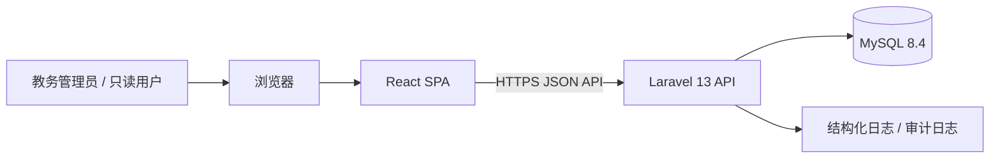
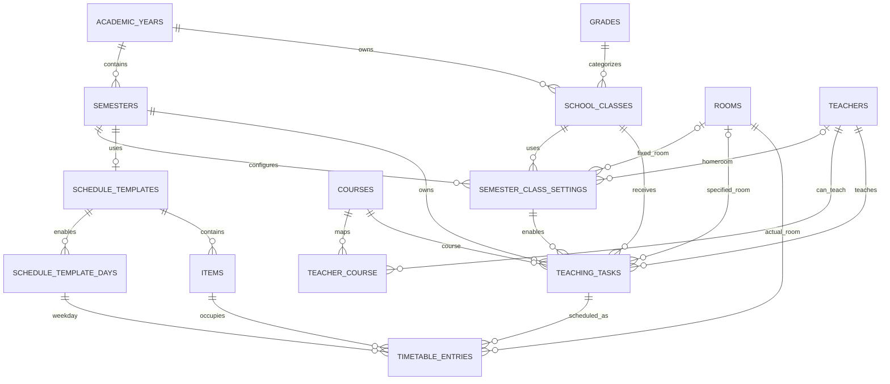
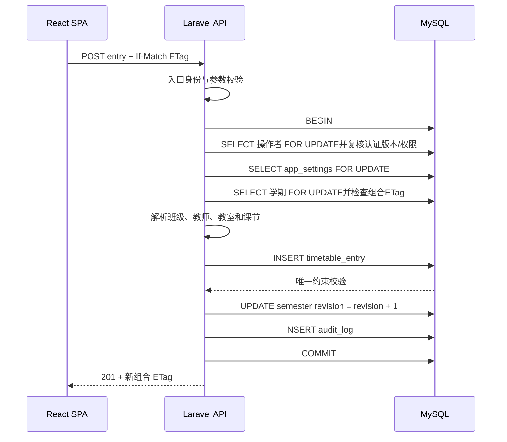

# 小学与初中排课系统架构设计文档

> 文档版本：V0.4  
> 文档日期：2026-08-21  
> 文档状态：第一阶段可实施技术架构基线  
> 关联需求：`school_timetable_system_design_v0.3.md`  
> 上一版本：V0.3

---

## 1. 文档目的

本文档在《小学与初中排课系统需求设计文档 V0.3》的基础上，明确第一阶段系统的技术架构、仓库组织、前后端边界、数据模型、接口规范、冲突控制、认证授权、测试策略、部署方式和后续扩展边界。V0.4 在上一版基础上进一步固定第一阶段范围，并补齐学期班级配置、生命周期状态、数据库一致性、排课不变量、全局资料/学期聚合组合修订号、更新删除矩阵、API 资源层级、会话撤销和 CSV 幂等提交规则。

第一阶段系统解决的问题是：

> 在选定学年和学期内，维护班级、教师、课程、教室、作息模板和教学任务，并将教学任务安排到普通周的可用课节中，同时保证班级、教师和教室不发生冲突。

本文档不重新定义业务需求；当本文档与需求文档冲突时，以需求文档为准，并通过架构决策记录修正文档。

---

## 2. 已确认技术栈

| 层级                    | 技术选择                               | 架构说明                                                                                                  |
| ----------------------- | -------------------------------------- | --------------------------------------------------------------------------------------------------------- |
| 前端语言                | TypeScript                             | 全项目启用严格模式，禁止以大量 `any` 绕过类型检查                                                         |
| 前端框架                | React 19.x                             | 初始化时锁定当前安全补丁版本，不在构建中使用漂移的 `latest`                                               |
| 前端统一工具链          | Vite+                                  | 由项目本地 `vite-plus` 提供 Vite/Rolldown、Vitest、Oxlint、Oxfmt、类型检查和 Vite Task                    |
| 前端测试                | Vitest + React Testing Library         | 通过 `vp test` 运行；测试配置写入 `vite.config.ts`，不单独维护 Jest 配置                                  |
| 跨应用 E2E              | Playwright                             | 固定准确版本，覆盖真实浏览器中的登录、排课、冲突、导出和只读流程                                          |
| 前端开发与构建          | Vite+ 的 `vp dev` / `vp build`         | 构建纯客户端 SPA，不做 SSR                                                                                |
| UI                      | shadcn/ui + Base UI                    | 使用预设代码 `b27GcrRo`，生成的组件源码归项目所有                                                         |
| 样式                    | shadcn 预设生成的 Tailwind/CSS 体系    | 主题令牌由预设和项目 CSS 统一管理                                                                         |
| 前端路由                | React Router                           | 学期 ID 显式进入路由，避免隐藏的跨学期操作                                                                |
| 服务端状态              | TanStack Query                         | 管理查询、缓存、Mutation 和失效刷新                                                                       |
| 表单                    | React Hook Form + Zod                  | 前端校验用于交互体验，后端校验始终是最终标准                                                              |
| JS 运行时与依赖管理入口 | Vite+ `vp`                             | 使用 `vp env`、`vp install`、`vp add`、`vp remove`、`vp dlx`，开发者和 CI 不直接调用底层包管理器          |
| Vite+ 底层包管理实现    | 由 Vite+ 托管的 pnpm 11.x              | 仅负责 workspace 与锁文件语义；版本由 `devEngines.packageManager` 声明并由 Vite+ 下载和调用               |
| Monorepo 任务执行       | Vite Task / `vp run`                   | 支持 workspace 感知、依赖顺序、并发执行和任务缓存，不再引入 Nx 或 Turborepo                               |
| 后端语言                | PHP 8.4                                | `composer.json` 固定为 `^8.4`                                                                             |
| 后端框架                | Laravel 13                             | 构建 REST JSON API 和后台业务服务                                                                         |
| 生产数据库              | MySQL 8.4 LTS                          | 作为生产环境和关键集成测试的数据库                                                                        |
| 快速测试数据库          | SQLite                                 | 用于大部分 Pest Feature 与数据库相关测试；纯业务单元测试通常不依赖数据库，不作为生产数据库                |
| PHP 包管理              | Composer                               | 仅管理 Laravel 应用及 PHP 依赖，Vite+ 不接管 Composer                                                     |
| PHP 代码质量            | Laravel Pint + Larastan/PHPStan        | Pint 统一格式，Larastan 执行框架感知静态分析；均固定准确版本                                              |
| 后端测试                | Pest + Pest Laravel Plugin             | 所有新增后端测试使用 Pest 语法与 `vendor/bin/pest`；`phpunit.xml` 仅保留为 Laravel 测试环境和测试套件配置 |
| API 契约                | OpenAPI 3.1 + Redocly CLI              | API 文档、前端类型生成和契约检查的共同依据；CLI 固定准确版本                                              |
| TypeScript API 客户端   | openapi-typescript 7.x + openapi-fetch | 前者从契约生成`paths`类型，后者提供类型安全的轻量 Fetch 客户端；初始化时固定准确版本                      |
| CI                      | GitHub Actions + `setup-vp`            | Vite+ 负责 Node、底层包管理器和前端缓存；PHP 使用独立 Composer/PHP 步骤                                   |

### 2.1 Vite+ 与版本锁定原则

Vite+ 是本项目所有 Node/TypeScript 工作流的统一入口，但项目可复现性必须由“项目本地版本 + 运行时声明 + 底层锁文件”共同保证。

- 文档编写时 Vite+ 官方最新版本为 `v0.2.9`；仓库初始化时应固定一个已经验证的准确版本，不使用漂移的 `latest` 作为长期依赖。
- 全局 `vp` 只是启动入口；仓库中的项目本地 `vite-plus` 版本才是项目工具链基线。
- 根目录通过 `devEngines.runtime` 固定一个验证过、且满足当前 Vite+ `engines`要求的 Node.js 24 准确补丁版本（Vite+ 0.2.x 的 Node 24 分支不得低于 24.11.0），通过 `devEngines.packageManager` 固定一个验证过的 pnpm 11 准确版本。`24.x`、`^11.0.0` 等范围只能用于兼容性声明，不能称为可复现锁定。
- Vite+ 当前会把依赖安装委托给 pnpm、npm、Yarn 或 Bun。本项目第一阶段保留 pnpm 作为被 Vite+ 托管的底层实现，但开发命令、文档和 CI 统一只使用 `vp`。
- 提交根目录 `pnpm-lock.yaml` 和 `pnpm-workspace.yaml`。它们是底层依赖解析与 workspace 的可复现元数据，不代表开发者直接使用 pnpm。
- 提交 `apps/api/composer.lock`。PHP 依赖仍由 Composer 独立锁定。
- GitHub Actions 中的 `voidzero-dev/setup-vp` 必须固定准确版本或提交 SHA，不使用不受控的浮动主标签。
- Vite+ 升级在独立 PR 中通过 `vp migrate` 完成，并运行 `vp toolchain`、`vp env doctor`、`vp check`、`vp run check`、`vp run test` 和`vp run build:web`。
- 提交`vp migrate`生成或更新的`vite`核心别名和 Vitest 准确版本 override；升级后用`vp toolchain vitest`核对，禁止只升级`vite-plus`而留下旧 Vitest pin，造成运行器内部版本分裂。
- React、shadcn CLI、Laravel、MySQL 等依赖仍按各自锁文件和版本约束管理。
- `composer.json`中的`^8.4`只表达 PHP 兼容范围，不锁定生产解释器；CI、容器或主机部署清单必须记录准确 PHP 8.4.x 和 MySQL 8.4.x 镜像标签，生产镜像进一步固定 digest。
- `composer.json`显式声明`ext-intl`和`ext-mbstring`；名称规范化统一调用`Normalizer`执行 NFC。运行镜像和 CI 还必须安装对应数据库驱动（生产`pdo_mysql`，SQLite 测试`pdo_sqlite`），启动检查不得在缺少扩展时静默降级为未规范化字符串。
- Dependabot 或 Renovate 只负责提出升级 PR，不自动跨主要版本合并。

根目录运行时声明示例：

```json
{
  "devEngines": {
    "runtime": {
      "name": "node",
      "version": "<初始化时验证且不低于24.11.0的24.x.y>",
      "onFail": "download"
    },
    "packageManager": {
      "name": "pnpm",
      "version": "<初始化时验证的11.x.y>",
      "onFail": "download"
    }
  }
}
```

以上尖括号是文档占位符，不能原样提交。初始化仓库时必须解析、验证并写入准确版本；升级准确版本仍通过独立 PR 完成。

### 2.2 shadcn 预设管理

预设代码 `b27GcrRo` 是 UI 初始基线，不应只存在于聊天记录或个人笔记中。

仓库初始化时使用 Vite+ 下载并运行固定版本的 shadcn CLI，同时保存预设解码结果：

```bash
vp dlx shadcn@<固定版本> preset decode b27GcrRo --json \
  > docs/architecture/shadcn-preset-b27GcrRo.json
```

在已经创建好的 Vite+ React 应用中初始化：

```bash
vp dlx shadcn@<固定版本> init \
  --template vite \
  --base base \
  --preset b27GcrRo \
  --cwd apps/web
```

初始化后必须提交：

- `apps/web/components.json`；
- 预设生成的全局 CSS 和主题变量；
- `apps/web/src/components/ui/` 中实际使用的组件；
- 解码后的预设 JSON。

后续不得直接重新运行初始化命令覆盖已有组件。需要升级时，应先查看差异并通过普通代码评审合并。

### 2.3 Vite+ 的管理边界

Vite+ 在本项目中负责：

- Node.js 运行时选择和安装；
- 底层 JavaScript 包管理器选择、下载和调用；
- Node workspace 依赖安装；
- 前端开发服务器和生产构建；
- JavaScript/TypeScript 格式化、Lint 和类型检查；
- 前端 Vitest 单元与组件测试；
- Monorepo 脚本编排、依赖顺序和任务缓存；
- 运行 shadcn、Playwright、OpenAPI 生成器等本地或临时二进制。

Vite+ 不负责：

- PHP 运行时；
- Composer 依赖解析；
- Laravel Artisan 的业务语义；
- MySQL、SQLite、Docker 或 Nginx 的生命周期；
- PHP 格式化、静态分析和 Pest 测试。

Vite+ 可以通过 `vp run` 启动 Composer、PHP 或 Docker 命令，作为统一操作入口，但这些命令的依赖和行为仍分别由 Composer、Laravel 和 Docker 负责。

---

## 3. 关键架构结论

第一阶段采用以下总体方案：

1. **一个 Git 仓库，采用轻量级 monorepo。**
2. **Vite+ 是 Node/TypeScript 工具链和 Monorepo 任务的唯一统一入口。**
3. **前端和后端是两个独立应用。**
4. **后端采用模块化单体，不拆微服务。**
5. **前端是纯 React SPA，后端提供 REST JSON API。**
6. **生产环境前后端使用同一站点来源，优先采用 Cookie Session 认证。**
7. **生产使用 MySQL，SQLite 只用于快速测试。**
8. **所有排课写入统一经过后端冲突校验服务和数据库唯一约束。**
9. **学期 ID 必须显式存在于路由、API 和查询键中。**
10. **Composer 继续独立管理 PHP；Vite+ 只负责统一调用，不跨语言接管依赖。**
11. **第一阶段不引入 Redis、消息队列、搜索服务或独立求解器服务。**
12. **Vite Task 已满足当前 Monorepo 编排需求，因此不引入 Nx 或 Turborepo。**
13. **未来自动排课能力通过领域接口预留，但第一阶段不实现，也不提前拆分为微服务。**
14. **前端测试统一使用 Vitest，后端测试统一使用 Pest；不并行维护 Jest 或 PHPUnit 风格测试体系。**
15. **第一阶段只实现手工排课；自动求解任务和候选结果不属于第一阶段表结构。**
16. **班级身份属于学年，固定教室和班主任由学期班级配置保存。**
17. **学校级只保存当前学期指针，当前学年由当前学期派生。**
18. **`draft`学期最多一套作息，`open`学期恰好一套完整作息；所有启用星期共享同一组课节。**
19. **全局排课基础资料写操作使用全局资料 ETag 防止旧页面覆盖，并推进全局资料修订号；学期级写操作校验由全局资料/学期聚合修订号组成的强 ETag，并推进该学期修订号（物理删除空草稿学期时改为推进全局版本）。**

---

## 4. Monorepo 评估与决策

### 4.1 可选方案

#### 方案 A：React 直接放入 Laravel 的 `resources/js`

优点：

- 单一应用结构最简单；
- Laravel 与前端天然同源；
- 部署步骤较少；
- Session 和 CSRF 配置简单。

缺点：

- 富交互排课工作台与 Laravel 资源目录耦合较深；
- 前端难以独立构建、测试和部署；
- OpenAPI 契约、前端类型包和未来其他客户端不容易形成清晰边界；
- 容易把页面组件、服务端模板和 API 实现混在同一应用结构中。

适合简单后台页面，不是本项目的最佳长期结构。

#### 方案 B：前后端两个独立仓库

优点：

- 团队和发布完全独立；
- 每个仓库工具链单一；
- 权限和生命周期可单独管理。

缺点：

- API 变更需要跨仓库协调；
- 契约、文档和生成类型容易漂移；
- 一个业务功能往往需要两个 PR；
- 第一阶段团队规模和系统规模不足以抵消维护成本。

适合前后端由长期独立团队维护、发布节奏明显不同的产品。

#### 方案 C：轻量级 monorepo，前后端保持独立应用

优点：

- 一个业务改动可以在同一 PR 中同时修改前端、后端、数据库迁移和 OpenAPI；
- 需求文档、架构文档和代码处于同一版本；
- 前后端仍然具有独立构建和部署能力；
- Vite+ 可以从根目录统一运行 Node workspace 任务，并调用 PHP/Composer 任务；
- 后续增加 API Client、共享类型和 E2E 测试时不需要重新迁移仓库。

成本：

- 根目录需要协调 Vite+ 和 PHP/Composer 两套运行环境；
- CI 仍需要区分 Web、API 和集成测试；
- 必须严格控制目录边界，不能让前端直接依赖后端源码。

### 4.2 最终决策

**选择方案 C：轻量级 monorepo。**

原因不是“项目大”，而是它具有以下特征：

- 当前只有一个产品；
- 前后端围绕同一业务模型协同变化；
- API 契约修改频率会较高；
- 需求、架构、数据库和 UI 需要保持同版本；
- 前后端仍有独立部署价值；
- Vite+ 已经提供 workspace 感知的任务执行、依赖顺序、并发和缓存，轻量 Monorepo 不需要额外构建平台。

### 4.3 使用 Vite+，不引入 Nx 或 Turborepo

Vite+ 在根目录通过 `vite.config.ts` 提供统一的 Lint、格式化和任务配置，`vp run` 可以按 workspace 包名、目录或依赖关系运行任务，并由 Vite Task 负责依赖排序和缓存。

第一阶段只有一个 Web 应用和一个 TypeScript API Client 包，引入 Nx 或 Turborepo 会形成重复的任务图、缓存层和配置入口。项目因此采用：

- 一个 Git 仓库；
- Vite+ 项目本地工具链；
- Vite Task / `vp run`；
- Vite+ 托管的底层 workspace 包管理器；
- Composer；
- GitHub Actions 多 Job。

只有在出现以下情况，并且 Vite Task 无法满足时，才重新评估其他 Monorepo 平台：

- 多个独立前端应用与多层共享包；
- 需要 Vite+ 当前不支持的远程缓存或受影响项目分析；
- 大型团队需要额外的项目图、所有权和生成器治理；
- 经过测量确认 CI 瓶颈无法通过 Vite Task 缓存和路径拆分解决。

### 4.4 Monorepo 边界规则

- `apps/web` 不得导入 `apps/api` 中的任何 PHP 文件。
- `apps/api` 不依赖前端构建产物才能运行 API 测试。
- 前后端只通过 HTTP API 和 OpenAPI 契约通信。
- 所有 Node 依赖安装、更新和脚本执行统一使用 `vp`；README、CI 和开发脚本不得直接写 `pnpm install`、`npm install` 等命令。
- `pnpm-workspace.yaml` 与 `pnpm-lock.yaml` 仅作为 Vite+ 托管的底层 workspace/锁文件，不作为团队操作入口。
- PHP 依赖只由 `apps/api/composer.json` 和 `apps/api/composer.lock` 管理。
- 根目录 Vite+ 检查只覆盖 JavaScript、TypeScript、JSON、CSS 和 Markdown 等前端资产；前端测试使用 Vitest，PHP 使用 Pint、静态分析器和 Pest。
- 不创建虚假的“跨语言共享代码”。可以共享契约、文档和生成物，但不能共享运行时代码。
- 前端和后端可以独立构建、独立发布、独立回滚。
- Vite+ 升级必须在 Monorepo 根目录执行，不能只升级某一个 workspace 包。

---

## 5. 推荐仓库结构

```text
school-timetable/
├── apps/
│   ├── web/                         # React + Vite+ SPA
│   │   ├── public/
│   │   ├── src/
│   │   │   └── test/
│   │   │       └── setup.ts         # Vitest / Testing Library 全局测试初始化
│   │   ├── components.json          # shadcn 配置
│   │   ├── package.json
│   │   ├── tsconfig.json
│   │   └── vite.config.ts           # Web 构建、测试和开发服务器配置
│   │
│   └── api/                         # Laravel 13 API
│       ├── app/
│       ├── bootstrap/
│       ├── config/
│       ├── database/
│       ├── routes/
│       ├── tests/
│       │   ├── Unit/                 # Pest 纯业务单元测试
│       │   ├── Feature/              # Pest HTTP、权限和数据库功能测试
│       │   ├── Pest.php              # Pest 全局配置、Trait 和辅助函数
│       │   └── TestCase.php          # Laravel Feature 测试应用基类
│       ├── phpunit.xml               # Laravel 测试环境/测试套件配置，非测试编写框架
│       ├── phpstan.neon               # Larastan/PHPStan 静态分析配置
│       ├── pint.json                  # Pint 格式规则
│       ├── artisan
│       ├── composer.json
│       └── composer.lock
│
├── packages/
│   └── api-client/                  # 由 OpenAPI 生成的 TS 类型及轻量客户端
│       ├── src/
│       └── package.json
│
├── contracts/
│   └── openapi.yaml                 # 前后端 API 契约源文件
│
├── tests/
│   └── e2e/                         # Playwright 跨应用关键流程
│
├── docs/
│   ├── requirements/
│   │   └── school_timetable_system_design_v0.3.md
│   ├── architecture/
│   │   ├── school_timetable_system_architecture_design_v0.4.md
│   │   ├── shadcn-preset-b27GcrRo.json
│   │   └── decisions/               # ADR 架构决策记录
│   └── api/
│
├── infra/
│   ├── nginx/
│   ├── docker/
│   └── scripts/
│
├── .github/
│   └── workflows/
│
├── compose.yaml                     # 本地 MySQL 和可选服务
├── playwright.config.ts             # E2E 服务地址、Trace 与浏览器配置
├── redocly.yaml                     # 固定 OpenAPI lint 规则与入口
├── vite.config.ts                   # Vite+ 根配置：检查、格式化和 Monorepo 任务
├── package.json                     # Vite+ 运行时声明、根任务和本地工具链版本
├── pnpm-workspace.yaml              # 由 Vite+ 托管的底层 workspace 元数据
├── pnpm-lock.yaml                   # 由 Vite+ 托管的底层 Node 依赖锁文件
├── .editorconfig
├── .env.example                     # 仅放根级开发变量说明，不放密钥
└── README.md
```

### 5.1 Vite+ Workspace 与底层包管理器

Vite+ 不是新的依赖锁文件格式。它提供统一命令，并根据仓库声明自动下载和调用底层包管理器。因此本项目采用以下规则：

- 团队只运行 `vp install`、`vp add`、`vp remove`、`vp dlx` 和 `vp run`；
- 底层采用 pnpm 11.x，但由 Vite+ 解析、下载和调用；
- workspace 范围仍由 `pnpm-workspace.yaml` 描述；
- 锁文件仍是 `pnpm-lock.yaml`；
- 不在开发文档和 CI 中直接调用 pnpm；
- 未来更换底层包管理器必须作为独立迁移，不得直接删除锁文件后重装。

`pnpm-workspace.yaml`：

```yaml
packages:
  - apps/web
  - packages/*
```

Laravel 不属于 Node workspace；它只是位于同一 Git 仓库中。

根目录 `package.json` 示例：

```json
{
  "name": "school-timetable",
  "private": true,
  "devEngines": {
    "runtime": {
      "name": "node",
      "version": "<初始化时验证且不低于24.11.0的24.x.y>",
      "onFail": "download"
    },
    "packageManager": {
      "name": "pnpm",
      "version": "<初始化时验证的11.x.y>",
      "onFail": "download"
    }
  },
  "devDependencies": {
    "@playwright/test": "<固定版本>",
    "@redocly/cli": "<固定版本>",
    "concurrently": "<固定版本>",
    "vite-plus": "<固定版本>"
  },
  "scripts": {
    "dev:web": "vp run @timetable/web#dev",
    "dev:api": "php apps/api/artisan serve --host=127.0.0.1 --port=8000",
    "dev": "vp exec concurrently -k --kill-others-on-fail \"vp run dev:api\" \"vp run dev:web\"",
    "check:web": "vp run @timetable/web#check",
    "check:api": "composer --working-dir=apps/api check",
    "check": "vp run check:web && vp run check:api",
    "test:web": "vp run @timetable/web#test",
    "test:web:watch": "vp run @timetable/web#test:watch",
    "test:web:coverage": "vp run @timetable/web#test:coverage",
    "test:api": "composer --working-dir=apps/api test",
    "test:api:unit": "composer --working-dir=apps/api test:unit",
    "test:api:feature": "composer --working-dir=apps/api test:feature",
    "test:api:mysql": "composer --working-dir=apps/api test:mysql",
    "test:e2e": "vp exec playwright test",
    "test": "vp run test:web && vp run test:api",
    "build:web": "vp run @timetable/web#build",
    "contract:lint": "vp exec redocly lint contracts/openapi.yaml",
    "contract:generate": "vp run @timetable/api-client#generate",
    "contract:check": "vp run contract:lint && vp run contract:generate && git diff --exit-code"
  }
}
```

`apps/web/package.json` 中保留前端包自己的任务：

```json
{
  "name": "@timetable/web",
  "private": true,
  "scripts": {
    "dev": "vp dev",
    "check": "vp check",
    "test": "vp test",
    "test:watch": "vp test watch",
    "test:coverage": "vp test run --coverage",
    "build": "vp build"
  }
}
```

后端在 `apps/api/composer.json` 中把 Pest 作为唯一测试入口：

```json
{
  "require-dev": {
    "larastan/larastan": "<与 PHP 8.4、Laravel 13 兼容的固定版本>",
    "laravel/pint": "<固定版本>",
    "pestphp/pest": "<与 PHP 8.4、Laravel 13 兼容的固定版本>",
    "pestphp/pest-plugin-laravel": "<兼容的固定版本>"
  },
  "scripts": {
    "lint": "@php vendor/bin/pint --test",
    "analyse": "@php vendor/bin/phpstan analyse --memory-limit=1G",
    "check": ["@lint", "@analyse"],
    "test": ["@php artisan config:clear --ansi", "@php vendor/bin/pest"],
    "test:unit": "@php vendor/bin/pest --testsuite=Unit",
    "test:feature": "@php vendor/bin/pest --testsuite=Feature",
    "test:mysql": "@php vendor/bin/pest --group=mysql"
  }
}
```

初始化后端测试框架时，先检查 Laravel 13 项目模板是否已经包含 Pest。若已经包含，只需核对版本并安装 Laravel Plugin；若是从 PHPUnit 基线迁移，在 `apps/api` 目录执行：

```bash
composer remove phpunit/phpunit
composer require pestphp/pest pestphp/pest-plugin-laravel --dev --with-all-dependencies
./vendor/bin/pest --init
```

`phpunit.xml` 仍然保留，因为 Laravel 使用它配置 `testing` 环境、测试套件和环境变量；但测试文件、团队命令、代码示例与 CI 统一以 Pest 为准，不再新增 PHPUnit Class 风格测试。

`phpstan.neon`加载 Larastan 扩展，第一阶段从能在生成基线代码上稳定通过的 level 6 起步并至少分析`app/`和`routes/`；禁止用全局`ignoreErrors`或自动生成大面积 baseline 把新增问题隐藏。`pint.json`只保存项目明确偏离 Laravel 预设的少量规则，两者的配置变化都需要评审。

所有需要直接导入 `vite-plus` 配置或运行 Vite+ 内置能力的 Node workspace，都应使用由 `vp create` 或 `vp migrate` 维护的一致 `vite-plus` 版本，禁止各包自行漂移。

### 5.2 根目录 Vite+ 配置

根目录 `vite.config.ts` 是 JavaScript/TypeScript 工具链的统一配置入口；Web 应用仍可以保留自己的 `apps/web/vite.config.ts`，用于 React 插件、开发代理、测试环境和构建细节。

示例：

```ts
import { defineConfig } from "vite-plus"

export default defineConfig({
  lint: {
    plugins: ["typescript"],
    options: {
      typeAware: true,
      typeCheck: true,
    },
    overrides: [
      {
        files: ["apps/web/**"],
        plugins: ["react"],
      },
      {
        files: ["**/*.test.ts", "**/*.test.tsx", "**/*.spec.ts", "**/*.spec.tsx"],
        plugins: ["vitest"],
      },
    ],
  },
  fmt: {
    singleQuote: false,
    semi: false,
  },
})
```

准确规则在项目初始化后根据生成代码调整。PHP 文件不交给 Oxfmt/Oxlint 处理。

Web 应用的测试配置写入 `apps/web/vite.config.ts`，不创建独立的 `vitest.config.ts`：

```ts
import react from "@vitejs/plugin-react"
import { defineConfig } from "vite-plus"

export default defineConfig({
  plugins: [react()],
  test: {
    environment: "jsdom",
    setupFiles: ["./src/test/setup.ts"],
    include: ["src/**/*.{test,spec}.{ts,tsx}"],
    coverage: {
      provider: "v8",
      reporter: ["text", "html", "lcov"],
    },
  },
})
```

`apps/web/src/test/setup.ts` 至少加载 Testing Library 的 DOM 断言：

```ts
import "@testing-library/jest-dom/vitest"
```

测试代码中的 Vitest API 优先从 Vite+ 的统一测试入口导入，确保与 Vite+ 内置 Vitest 版本一致：

```ts
import { describe, expect, it, vi } from "vite-plus/test"
```

### 5.3 常用命令

```bash
vp install                         # 安装整个 Node workspace 依赖
vp env doctor                      # 检查 Node、底层包管理器和声明冲突
vp toolchain                       # 查看项目实际使用的 Vite+ 工具链版本
vp run dev                         # 从根目录同时启动 Web 和 API
vp check                           # 从根目录检查 JS/TS workspace
vp run check                       # 聚合运行前端检查与后端 Pint/Larastan
vp run test                        # 聚合运行 Vitest 与 Pest
vp run test:web                    # 仅运行前端 Vitest
vp run test:api                    # 仅运行后端 Pest（SQLite 默认配置）
vp run test:api:mysql              # 仅运行 Pest 的 MySQL 集成测试组
vp run test:e2e                    # 运行 Playwright 跨应用 E2E
vp run build:web                   # 构建 Web 应用
vp run contract:lint               # 使用固定 Redocly CLI 校验 OpenAPI 3.1
vp run contract:check              # 校验、生成并检查 OpenAPI 客户端差异
composer --working-dir=apps/api install
composer --working-dir=apps/api check
```

必须区分：

- `vp dev` 是 Vite+ 内置的 Vite 开发服务器；
- `vp run dev` 是根目录 `package.json` 中的聚合开发脚本；
- `vp check`是 Vite+ 内置的 JS/TS 检查，`vp run check`才是仓库前后端聚合检查；
- `vp test` 是 Vite+ 内置的 Vitest 命令，默认执行一次完整测试；`vp test watch` 才进入监听模式；
- `composer --working-dir=apps/api test` 运行后端 Pest；
- `vp run test` 是根目录依次执行前端 Vitest 和后端 Pest 的聚合脚本。

根目录只负责协调，不承载业务运行代码。

---

## 6. 系统上下文与部署边界

### 6.1 第一阶段用户

第一阶段固定支持三类角色：

- **管理员（admin）**：用户、系统上下文和全部业务配置管理；
- **排课员（scheduler）**：维护学年学期、基础资料、教学任务和课表；
- **只读查看者（viewer）**：查看和导出班级、教师和教室课表。

第一阶段不提供公开注册、邮件找回密码、单点登录和教师个人账号。首个管理员通过部署环境中的一次性 Artisan 命令创建，命令交互读取密码或安全读取环境注入值，不把默认密码写入仓库、镜像或 Seeder。详细到每个端点的权限矩阵必须写入 OpenAPI 描述和后端 Policy 测试。

### 6.2 系统上下文图



### 6.3 生产部署建议

推荐生产环境保持同源：

```text
https://timetable.example.com/              -> React 静态资源
https://timetable.example.com/api/v1/*      -> Laravel API
https://timetable.example.com/sanctum/*     -> Laravel Sanctum CSRF
```

反向代理负责：

- `/` 返回 Vite 构建后的静态文件；
- `/api`、`/sanctum` 转发给 Laravel/PHP-FPM；登录和退出使用`/api/v1/auth/*`，已包含在`/api`中；
- 所有请求强制 HTTPS；
- 保留原始`Host`并正确传递`X-Forwarded-For`、`X-Forwarded-Proto`；Laravel 只信任实际反向代理网段，使 URL 生成、Secure Cookie 和客户端 IP 判断与外部 HTTPS 一致；
- 代理与 PHP 上传上限都略高于应用层2 MiB CSV限制，应用仍独立校验实际文件大小；
- 为 SPA 路由配置 `index.html` 回退，但不得吞掉 `/api` 的 404。

同源部署的好处：

- Cookie Session 认证更简单；
- 减少 CORS 配置；
- CSRF 处理更清晰；
- 用户只访问一个域名；
- 前后端仍可用独立构建产物部署。

生产环境还必须由 Cron 每分钟执行一次`php artisan schedule:run`。第一阶段调度器只运行预检记录清理等短任务，不启动队列 Worker；清理命令必须幂等，并使用数据库 Cache/Lock 的`onOneServer`/`withoutOverlapping`等价保护，避免多实例重复并发清理。

### 6.4 第一阶段不采用微服务

排课系统当前业务规模、数据规模和团队规模都不需要微服务。拆分服务会额外引入：

- 分布式事务；
- 服务发现；
- 远程调用失败；
- 多套部署；
- 多数据库一致性；
- 更复杂的本地开发环境。

因此后端采用一个 Laravel 应用、一个主数据库的模块化单体。

---

## 7. 前端架构

### 7.1 前端职责

前端负责：

- 页面路由和导航；
- 表单交互和即时校验；
- 学年、学期和资源筛选；
- 教学任务录入；
- 周课表网格展示；
- 手工放置、移动和删除课程；
- 展示后端返回的冲突原因；
- 班级、教师和教室课表切换；
- 只读历史学期展示。

前端不负责最终业务判断。任何“前端看起来没有冲突”的操作都必须经过后端重新校验。

### 7.2 推荐目录

```text
apps/web/src/
├── app/
│   ├── router.tsx
│   ├── providers.tsx
│   ├── query-client.ts
│   └── error-boundary.tsx
├── routes/
│   ├── login/
│   ├── dashboard/
│   ├── academic-years/
│   ├── class-settings/
│   ├── schedule-template/
│   ├── teaching-tasks/
│   └── timetable/
├── features/
│   ├── auth/
│   ├── academic-calendar/
│   ├── grades/
│   ├── classes/
│   ├── semester-class-settings/
│   ├── teachers/
│   ├── courses/
│   ├── rooms/
│   ├── schedule-template/
│   ├── teaching-tasks/
│   └── timetable/
├── components/
│   ├── ui/                          # shadcn 生成源码
│   └── shared/                      # 项目通用组件
├── lib/
│   ├── api/
│   ├── auth/
│   ├── errors/
│   └── utils/
├── hooks/
├── types/
└── main.tsx
```

### 7.3 路由设计

学期是系统最重要的数据隔离维度。前端路由必须显式包含学期 ID，而不是只依赖全局“当前学期”。

建议路由：

```text
/login
/app
/app/academic-years
/app/academic-years/:academicYearId/classes
/app/semesters/:semesterId/class-settings
/app/semesters/:semesterId/schedule-template
/app/semesters/:semesterId/teaching-tasks
/app/semesters/:semesterId/timetable
/app/semesters/:semesterId/timetables/classes/:classId
/app/semesters/:semesterId/timetables/teachers/:teacherId
/app/semesters/:semesterId/timetables/rooms/:roomId
```

规则：

- 当前学期只用于进入系统时的默认跳转；
- 初始化前或关闭最后一个开放学期后，`current_semester_id`可以为空；`/app`必须展示明确的未设置状态，管理员可进入初始化/选择流程，不能拼出`/semesters/null`或按系统日期猜测；
- 切换学期后 URL 必须变化；
- 浏览器刷新后仍能恢复正确学期；
- 分享链接时不会错误打开其他学期；
- 所有学期级 Query Key 必须包含 `semesterId`；学年班级 Query Key 使用 `academicYearId`，全局基础资料不伪造学期维度；
- 所有学期级 Mutation 必须显式传递 `semesterId`。

### 7.4 状态管理

状态按性质拆分：

| 状态类型                 | 管理方式                       |
| ------------------------ | ------------------------------ |
| 服务端数据               | TanStack Query                 |
| 当前路由和学期           | React Router URL 参数          |
| 表单状态                 | React Hook Form                |
| 临时弹窗、选择和悬停状态 | React 本地 state / reducer     |
| 登录用户                 | `/api/v1/me` + TanStack Query  |
| 排课网格草稿交互         | Timetable feature 内部 reducer |

第一阶段不引入 Redux 或通用全局状态库。只有出现多个页面必须共享、且无法由 URL 或 Query 表达的复杂客户端状态时，再评估 Zustand 等方案。

### 7.5 API 客户端

前端不得在各组件中散落原始 `fetch`。

建议结构：

```text
packages/api-client/
├── src/generated-types.ts
├── src/client.ts
├── src/errors.ts
└── src/index.ts
```

原则：

- 使用固定版本的`openapi-typescript`从本地`contracts/openapi.yaml`生成 TypeScript `paths`类型，生成文件禁止手工修改；
- 使用`openapi-fetch`创建一个轻量类型安全客户端，通过中间件统一处理 Base URL、Cookie、CSRF、ETag 和错误；
- 所有请求使用 `credentials: "include"`；
- 登录前先请求`/sanctum/csrf-cookie`；对非安全方法读取并 URL 解码可访问的`XSRF-TOKEN`Cookie，写入`X-XSRF-TOKEN`请求头，绝不尝试读取 HttpOnly Session Cookie；
- 统一识别 401、403、409、412、419、422、428 和 500；
- API 错误转换为明确的前端错误类型；
- 页面组件只调用 feature hooks，例如 `useTeachingTasks()`、`usePlaceTimetableEntry()`。

`packages/api-client`的`generate`脚本等价于：

```bash
vp exec openapi-typescript ../../contracts/openapi.yaml -o src/generated-types.ts
```

CI 先校验 OpenAPI，再运行生成脚本并检查 Git 差异；不能从正在运行的 API 动态下载契约作为构建输入。

### 7.6 课表网格

周课表不是普通日期日历，不建议第一阶段直接采用通用日历组件。它具有以下特殊结构：

- 横向通常是星期；
- 纵向是学校自定义课节；
- 非课程课节需要特殊展示；
- 同一课程与班级、教师、教室三种资源关联；
- 需要显示教学任务剩余课时；
- 需要即时显示冲突原因。

因此建议使用 CSS Grid 实现专用 `TimetableGrid`。

组件层次可为：

```text
TimetableWorkbench
├── TimetableToolbar
├── UnscheduledTaskPanel
├── TimetableGrid
│   ├── PeriodHeader
│   ├── DayColumn
│   ├── TimetableCell
│   └── TimetableEntryCard
└── ConflictPanel
```

业务规则不得写入拖拽回调中。拖拽或点击操作只产生一个命令：

```ts
type PlaceEntryCommand = {
  semesterId: number
  teachingTaskId: number
  weekday: number
  itemId: number
  expectedEtag: string
}
```

`expectedEtag`是最近一次学期级查询返回的完整 ETag。统一 API Client 将它原样写入`If-Match`，前端不得解析、拼接或自行递增其中的版本号，也不把它混入业务 JSON。

全局基础资料页面另行保存与当前可编辑数据在同一响应中返回的`expectedCatalogEtag`，并在年级、教师、教师课程关联、课程、教室、学年、学年班级和新建学期等全局资料 Mutation 中原样提交。`GET /api/v1/catalog`只用于没有既有资源表示可读取的创建命令或显式刷新基线；前端不得把旧资源数据与后来单独获取的新 ETag 拼在一起提交。全局 ETag 与学期组合 ETag 是两种不同作用域的不透明值，客户端不得互换使用。

命令发送给 API，成功后刷新缓存；失败时展示后端返回的具体冲突。

第一阶段可以先实现“选中教学任务 → 点击目标格放置”，再增加拖拽。即使增加拖拽，也必须保留键盘或按钮操作方式。

### 7.7 shadcn 与 Base UI 使用规则

- `components/ui` 中的代码属于项目，可以修改，但修改应有明确原因；
- 业务组件不得全部堆入 `components/ui`；
- UI 基础组件只处理样式、可访问性和交互原语；
- 业务含义放入 `features/*`；
- 链接和按钮必须保持正确 HTML 语义；
- 表格、弹窗、下拉选择和 Combobox 优先使用预设对应的 Base UI 组件；
- 所有自定义主题值通过 CSS 变量表达；
- 禁止在页面中大量硬编码颜色和尺寸；
- 预设升级通过差异评审完成，不能直接覆盖。

### 7.8 前端错误处理

前端统一处理以下错误：

| HTTP 状态 | 前端行为                                                                   |
| --------- | -------------------------------------------------------------------------- |
| 401       | 清理用户缓存并跳转登录页                                                   |
| 403       | 显示无权限，不自动重试                                                     |
| 404       | 显示资源不存在或已停用                                                     |
| 409       | 展示班级、教师、教室或业务状态冲突                                         |
| 412       | 提交基线已过期；按错误作用域刷新全局资料或学期数据后重试                   |
| 419       | CSRF 会话已过期；重新获取 CSRF Cookie 后至多自动重试一次，仍失败则回登录页 |
| 422       | 映射表单字段错误                                                           |
| 428       | 条件写入缺少对应作用域必需的`If-Match` ETag                                |
| 429       | 提示请求过于频繁                                                           |
| 500       | 显示通用错误和请求编号                                                     |

React Error Boundary 只处理渲染级异常，不能代替 API 错误处理。

---

## 8. 后端架构

### 8.1 模块化单体

Laravel 应用按业务领域划分逻辑模块，但仍然是一个部署单元和一个数据库。

建议模块：

1. `Identity`：用户、登录、权限；
2. `AcademicCalendar`：学年、学期、当前上下文；
3. `Resources`：年级、学年班级、教师、课程、教室；
4. `SemesterClassSetting`：学期班级固定教室、班主任和启用状态；
5. `ScheduleTemplate`：作息模板和课节；
6. `TeachingTask`：学期教学任务；
7. `Timetable`：排课结果、冲突检测、完整性检查；
8. `Audit`：重要操作记录。

### 8.2 推荐目录

```text
apps/api/app/
├── Modules/
│   ├── Identity/
│   ├── AcademicCalendar/
│   ├── Resources/
│   ├── SemesterClassSetting/
│   ├── ScheduleTemplate/
│   ├── TeachingTask/
│   ├── Timetable/
│   └── Audit/
├── Http/
│   ├── Controllers/Api/V1/
│   ├── Requests/Api/V1/
│   ├── Resources/Api/V1/
│   └── Middleware/
├── Policies/
├── Providers/
└── Support/
```

每个模块可包含：

```text
Models/
Actions/
Services/
Data/
Enums/
Exceptions/
Queries/
```

第一阶段不将模块制作成独立 Composer Package，也不为每个模块创建独立数据库。

### 8.3 分层职责

#### Controller

只负责：

- 接收已经验证的请求；
- 调用 Action；
- 返回 API Resource；
- 不直接编写复杂 Eloquent 查询和业务规则。

#### Form Request

负责：

- 字段格式校验；
- 基础引用存在性校验；
- 调用 Policy 进行授权；
- 不承担跨多资源的完整排课冲突判断。

#### Action

表示一个明确业务操作，例如：

- `CreateAcademicYear`；
- `SetCurrentSemester`；
- `CopyScheduleTemplate`；
- `CopyTeachingTasks`；
- `PlaceTimetableEntry`；
- `MoveTimetableEntry`；
- `RemoveTimetableEntry`；
- `CloseSemester`。

Action 负责事务边界和调用领域服务。

#### Service

封装可复用规则，例如：

- `TimetableConflictService`；
- `TimetableCompletenessService`；
- `RoomResolver`；
- `SemesterEditGuard`；
- `ItemOverlapValidator`。

#### Model

Eloquent Model 负责关系、类型转换和简单领域方法，不应塞入完整业务流程。

年级、班级、教师、课程和教室不得使用自动隐藏`inactive`记录的全局 Scope；录入选择列表显式查询可用资源，历史关系和课表查询必须仍能加载已停用记录。软删除也不能替代本文定义的停用/受限物理删除语义。

### 8.4 关键写入原则

所有排课写操作必须：

1. 完成请求入口的身份检查和参数校验；
2. 开启事务，先以`SELECT ... FOR UPDATE`锁定操作者`users`行，重新校验启用状态、`auth_version`、首次改密标记和当前角色，并在事务内完成最终授权；
3. 验证目标学期可编辑；
4. 按固定顺序锁定`app_settings`和学期行，并原子比较请求 ETag 中的全局资料/学期修订号；
5. 验证教学任务为`confirmed`，且任务、班级和课节属于同一学期/学年；
6. 验证星期已启用，课节已启用且`allows_course=true`、`counts_as_course=true`；
7. 验证班级、所属年级、本学期班级配置、教师、课程和解析后的教室允许参与新排课；
8. 解析非空实际教室；
9. 在同一事务和学期行锁保护下检查教学任务当前已排课时，禁止超过`weekly_items`；
10. 写入数据库，并依赖有明确名称的唯一约束阻止并发资源冲突；
11. 依赖组合外键或等价数据库约束保证排课结果的冗余学期、班级、教师、课程与教学任务一致；
12. 将数据库约束冲突转换为稳定、可读的业务错误；
13. 原子推进学期课表修订号；
14. 在同一事务中写入审计日志；
15. 任一步失败时回滚全部写入。

前端不能绕过这些 Action 直接调用通用 CRUD 更新排课结果。

事务闭包内不得发送邮件、HTTP 请求或执行其他不可回滚副作用。对 MySQL deadlock/serialization failure 可以由 Laravel 做有上限的整事务重试（建议最多3次），每次都重新取得锁、复核操作者和 ETag；业务冲突、校验失败和唯一约束错误不得盲目重试。

---

## 9. 数据库架构

### 9.1 数据库选择

- 生产：MySQL 8.4 LTS；
- 本地开发：MySQL 8.4，必要时也可使用本地安装；
- 快速自动测试：SQLite 内存数据库或临时文件；
- 关键集成测试：MySQL 8.4。

SQLite 的作用是提高测试速度，而不是模拟 MySQL 的所有行为。

生产业务表统一使用 InnoDB；事务、行锁、外键和唯一约束都依赖该引擎，Migration/就绪检查发现非 InnoDB 表时必须失败，不能降级继续运行。

### 9.2 数据库可移植性规则

为了让同一套 Laravel Migration 同时运行在 MySQL 和 SQLite：

- 核心表不使用 MySQL `ENUM`；有限值字段保存为字符串，并同时使用 PHP Enum 和有稳定名称的数据库`CHECK`限制合法集合，不能只依赖应用校验；
- 单行即可判断的核心不变量，例如日期先后、正整数、非负修订号、星期范围和条件必填，优先同时落为数据库`CHECK`；跨行、跨表或聚合规则继续由事务 Action 校验；
- 核心约束不依赖 JSON 查询；
- 不使用数据库触发器实现业务规则；
- 不使用 MySQL 专属生成列作为第一阶段核心功能；
- 尽量通过 Schema Builder 编写 Migration；
- 必须启用 SQLite 外键校验；
- 原始 SQL 必须有 MySQL 和 SQLite 双环境测试；
- 不依赖 MySQL 的零日期、隐式类型转换或排序副作用；
- 所有人类可见名称（包括允许重名的教师姓名和简称）在应用边界统一执行 Unicode NFC、首尾空白清理和连续空白折叠后再保存，唯一判断使用规范化后的值；邮箱执行首尾清理、格式校验和小写化，内部空白直接拒绝；班级`code`和教师`employee_no`执行 NFC、首尾清理和 Unicode 大写化。禁止依赖 MySQL 与 SQLite 不同的默认排序规则完成这些规范化；
- NFC 由 Composer 声明的 PHP `ext-intl`实现，长度和大小写规范化使用明确的 Unicode/多字节函数；扩展缺失属于启动/部署失败，不允许退回字节级字符串处理；
- 可选字符串在相同规范化后若为空统一保存为`NULL`，必填字符串规范化后为空则拒绝；表单、CSV 预检和单条 API 必须复用同一规范化函数，不能把空字符串和`NULL`当成两种业务值；
- MySQL 业务字符串默认使用`utf8mb4`和`utf8mb4_0900_as_cs`，需要不区分大小写的邮箱/编号先在应用层规范化，不临时改用另一套列排序规则；SQLite 快速测试覆盖规范化函数，生产唯一性仍由 MySQL 集成测试确认；
- 所有生产约束最终以 MySQL 行为为准。

### 9.3 核心表

#### `users`

| 字段                 | 说明                              |
| -------------------- | --------------------------------- |
| id                   | 主键                              |
| name                 | 用户名称                          |
| email                | 登录账号，唯一                    |
| password             | 哈希密码                          |
| role                 | 第一阶段角色标识                  |
| is_active            | 是否可登录                        |
| must_change_password | 是否必须在下次登录后修改密码      |
| auth_version         | 认证状态版本，非负大整数，初始为0 |
| timestamps           | 创建、更新时间                    |

约束：`email`使用规范化后的唯一索引；密码只保存安全哈希；`auth_version`具有非负数据库`CHECK`。管理员重置密码后设置`must_change_password=true`并推进`auth_version`，API永不返回密码、密码哈希或认证版本。修改角色、登录账号或状态的 Action 必须在事务中按用户 ID 升序锁定操作者、目标用户及相关启用管理员，重验授权并拒绝停用或降级最后一个`is_active=true`的`admin`；认证敏感状态实际变化时只推进一次目标用户`auth_version`。

#### `academic_years`

| 字段       | 说明                |
| ---------- | ------------------- |
| id         | 主键                |
| name       | 例如“2026—2027学年” |
| start_date | 开始日期            |
| end_date   | 结束日期            |
| status     | draft、open、closed |
| timestamps | 创建、更新时间      |

约束：

- `name` 唯一；
- 命名`CHECK`保证`start_date < end_date`；
- 只有所属学期全部为`closed`时，学年才能关闭；“当前”不使用状态字段表达。

#### `semesters`

| 字段               | 说明                |
| ------------------ | ------------------- |
| id                 | 主键                |
| academic_year_id   | 所属学年            |
| name               | 上学期、下学期      |
| sequence           | 1、2                |
| start_date         | 开始日期            |
| end_date           | 结束日期            |
| status             | draft、open、closed |
| timetable_revision | 课表修订号，初始为0 |
| timestamps         | 创建、更新时间      |

约束：

- `academic_year_id`使用`RESTRICT`外键；
- `unique(academic_year_id, sequence)`；
- `sequence`使用数据库`CHECK`或等价约束限制为1或2；学年从`draft`转为`open`前必须恰好各有一条，不能创建第三学期；
- 命名数据库`CHECK`保证`sequence=1`时名称为“上学期”、`sequence=2`时名称为“下学期”，避免名称与排序语义相反；
- `academic_year_id`、`sequence`和`name`创建后由 Action 视为不可变；误建空草稿走删除重建，不提供交换学期身份的更新路径；
- `timetable_revision`使用非负大整数`CHECK`；
- 为跨表学年一致性的组合外键提供`unique(id, academic_year_id)`候选键；
- `start_date < end_date`，日期按首尾包含处理且必须位于学年日期范围内；同一学年按`sequence`排序后必须满足`previous.end_date < next.start_date`，允许中间有假期空档；
- `closed` 学期禁止普通写操作；
- 当前学期必须为`open`状态；重新打开`closed`学期必须走高权限审计操作。

#### `app_settings`

第一阶段为单学校实例，可使用单行配置表：

| 字段                | 说明                                        |
| ------------------- | ------------------------------------------- |
| id                  | 固定单行主键                                |
| current_semester_id | 当前学期，唯一权威指针；首次初始化前可空    |
| catalog_revision    | 全局排课基础资料修订号，非负大整数，初始为0 |
| timezone            | 学校时区                                    |
| timestamps          | 创建、更新时间                              |

当前学年通过`current_semester_id -> semesters.academic_year_id`派生，不单独保存`current_academic_year_id`，从结构上消除二者不一致的可能。数据库以`CHECK(id = 1)`或等价约束保证只能使用固定主键，Migration/安装流程必须确定性创建这条唯一`app_settings`记录，应用不得在并发请求中“发现缺失后懒创建”。安装流程要求显式提供并验证 IANA `SCHOOL_TIMEZONE`（例如`Asia/Shanghai`）后写入，不能读取服务器操作系统默认时区作为学校配置。`current_semester_id`使用可空外键和`RESTRICT`删除策略；删除误建且无子数据的学期前必须先清空指针。`catalog_revision`使用非负大整数`CHECK`，`timezone`只接受应用验证过的 IANA 时区标识。

设置当前学期时在事务中锁定`app_settings`并校验目标学期为`open`。该接口是提交明确目标值的学校级命令，第一阶段采用“按行锁串行、最后完成的有效命令生效”的显式语义，而不是把指针混入排课并发版本；每次实际切换均写审计并返回最终上下文。`catalog_revision`覆盖会出现在学期课表/任务响应中的全局年级、教师、教师课程关联、课程、教室、学年班级和学年展示信息，以及学校时区；用户和当前学期指针不属于该版本。学期写入基线响应不得嵌入随当前指针变化的`is_current`，当前状态只从独立`/context`响应读取。

#### `grades`

| 字段       | 说明     |
| ---------- | -------- |
| id         | 主键     |
| name       | 年级名称 |
| sort_order | 展示顺序 |
| is_active  | 是否启用 |

约束：`name`唯一，`sort_order`唯一且为非负整数。批量调整顺序时使用事务内两阶段临时排序值，不能依次直接交换两个唯一值。

#### `teachers`

| 字段        | 说明           |
| ----------- | -------------- |
| id          | 主键           |
| employee_no | 可选教师编号   |
| name        | 教师姓名       |
| is_active   | 是否参与新任务 |
| timestamps  | 创建、更新时间 |

约束：`employee_no`为空时允许多个空值；非空教师编号必须唯一。教师姓名不唯一，以支持同名教师。

#### `courses`

| 字段       | 说明           |
| ---------- | -------------- |
| id         | 主键           |
| name       | 课程名称       |
| short_name | 课表简称，可空 |
| is_active  | 是否启用       |
| timestamps | 创建、更新时间 |

约束：规范化后的`name`唯一，`short_name`允许重复。

#### `teacher_course`

| 字段       | 说明       |
| ---------- | ---------- |
| teacher_id | 教师       |
| course_id | 可教授课程 |

约束：

- `unique(teacher_id, course_id)`。

该表用于录入筛选和非阻断警告，不代表永久任课关系，也不作为保存教学任务的硬外键。停用教师仍由任务 Form Request 和 Action 阻止用于新任务。

#### `rooms`

| 字段       | 说明                                                                          |
| ---------- | ----------------------------------------------------------------------------- |
| id         | 主键                                                                          |
| name       | 教室名称                                                                      |
| type       | classroom、playground、music_room、art_room、laboratory、computer_room、other |
| is_active  | 是否可用于新排课                                                              |
| timestamps | 创建、更新时间                                                                |

约束：规范化后的`name`唯一，`type`由数据库`CHECK`限制为表中列出的第一阶段集合。第一阶段每条教室记录的并发容量固定为1；可共享区域拆成多条独立教室记录。

#### `school_classes`

不建议使用数据库表名 `classes`，避免与代码语言概念混淆。

| 字段             | 说明             |
| ---------------- | ---------------- |
| id               | 主键             |
| academic_year_id | 所属学年         |
| grade_id         | 所属年级         |
| name             | 七年级1班        |
| code             | 可选导入编号     |
| status           | active、inactive |
| timestamps       | 创建、更新时间   |

约束：

- `unique(academic_year_id, name)`；
- 非空`code`在同一学年内唯一；
- `academic_year_id`和`grade_id`使用`RESTRICT`外键，已被班级引用的学年/年级不能物理删除；
- 为跨表学年一致性的组合外键提供`unique(id, academic_year_id)`候选键；
- 停用不删除历史引用；
- 不建立跨学年班级继承关系。
- 学年任一学期关闭后，名称、年级等身份字段只能通过高权限审计纠错操作修改。

#### `semester_class_settings`

班级身份属于学年，容易随学期变化的固定教室和班主任保存在本表。

| 字段                | 说明                             |
| ------------------- | -------------------------------- |
| id                  | 主键                             |
| semester_id         | 所属学期                         |
| academic_year_id    | 冗余所属学年，用于数据库组合外键 |
| school_class_id     | 班级                             |
| fixed_room_id      | 本学期固定教室，可空             |
| homeroom_teacher_id | 本学期班主任，可空               |
| status              | active、inactive                 |
| timestamps          | 创建、更新时间                   |

约束：

- 命名唯一约束`uq_semester_class_setting`：`unique(semester_id, school_class_id)`；
- `fk_setting_semester_year`以`(semester_id, academic_year_id)`引用`semesters(id, academic_year_id)`，`fk_setting_class_year`以`(school_class_id, academic_year_id)`引用`school_classes(id, academic_year_id)`，从数据库层保证班级与学期同属一个学年；Action仍需在写入前返回可读错误；
- 班级参与某学期教学任务前必须已有一条配置记录；`fixed_room_id`和`homeroom_teacher_id`可以为空，但配置记录本身不能缺失；
- `fixed_room_id`和`homeroom_teacher_id`使用外键`RESTRICT`，基础资料通过停用而不是删除保留历史；
- `closed`学期中的配置只读；
- 修改固定教室只影响后续新建排课结果，已有`actual_room_id`不自动变化；批量迁移必须走独立事务命令。

#### `schedule_templates`

第一阶段一个学期最多使用一套全校作息模板，因此用唯一约束保证同一学期不能出现第二条模板。`draft`学期可以暂时没有模板，转为`open`前由生命周期 Action 校验模板已经存在且结构完整。`items`不按年级、班级或星期拆分，所有`schedule_template_days.is_enabled=true`的星期共享同一组课节；这是明确的一期边界，不是可由页面配置绕过的默认值。

| 字段        | 说明           |
| ----------- | -------------- |
| id          | 主键           |
| semester_id | 所属学期，唯一 |
| name        | 模板名称       |
| timestamps  | 创建、更新时间 |

约束：

- 命名唯一约束`uq_schedule_template_semester`：`unique(semester_id)`；
- `semester_id`使用`RESTRICT`外键；
- 为组合外键提供`unique(id, semester_id)`候选键。
- 每个学期转为`open`前必须恰好存在一条模板、星期一至星期日各一条`day`记录、至少一个启用星期，以及至少一个已启用的`course`课节。

#### `schedule_template_days`

| 字段                 | 说明                             |
| -------------------- | -------------------------------- |
| id                   | 主键                             |
| schedule_template_id | 所属模板                         |
| semester_id          | 冗余所属学期，用于组合外键和查询 |
| weekday              | ISO 星期编号，1=周一、…、7=周日  |
| is_enabled           | 是否启用                         |

约束：

- `unique(schedule_template_id, weekday)`；
- 命名候选键`unique(semester_id, weekday)`，供课表结果组合外键使用；每学期最多一套模板使该约束与业务模型一致；
- `(schedule_template_id, semester_id)`组合外键引用`schedule_templates(id, semester_id)`。
- 模板初始化时一次性创建星期一至星期日七条记录；不得用“缺少记录”表达停用，停用只能使用`is_enabled=false`。

第一阶段默认启用周一至周五。

#### `items`

| 字段                 | 说明                                 |
| -------------------- | ------------------------------------ |
| id                   | 主键                                 |
| schedule_template_id | 所属模板                             |
| semester_id          | 冗余所属学期，用于组合外键和查询     |
| name                 | 早读、上午第1节等                    |
| type                 | course、fixed_non_course、self_study |
| start_time           | 开始时间                             |
| end_time             | 结束时间                             |
| sort_order           | 展示顺序                             |
| allows_course        | 是否允许正式课程                     |
| allows_teacher       | 是否允许未来安排教师                 |
| counts_as_course     | 是否计入普通课时                     |
| show_in_official     | 是否显示在正式课程表                 |
| show_in_full         | 是否显示在完整作息表                 |
| is_active            | 是否启用                             |
| timestamps           | 创建、更新时间                       |

约束：

- `unique(schedule_template_id, sort_order)`；
- `unique(schedule_template_id, name)`；
- 为排课结果组合外键提供`unique(id, semester_id)`候选键；
- `(schedule_template_id, semester_id)`组合外键引用`schedule_templates(id, semester_id)`；
- `start_time < end_time`；
- 命名数据库`CHECK`保证开始和结束时间的秒均为`00`，与 API 的`HH:mm`分钟精度一致；
- 同一模板中的课节按左闭右开区间不得重叠，判定公式为`a.start < b.end && b.start < a.end`，首尾相接允许；
- 已被课表引用的课节不能物理删除。

字段组合由后端按`type`规范化，不接受任意布尔组合，并由命名数据库`CHECK`兜底：

| type             | allows_course | counts_as_course | allows_teacher |  show_in_official | show_in_full |
| ---------------- | ------------: | ---------------: | -------------: | ----------------: | -----------: |
| course           |          true |             true |           true |              true |         true |
| fixed_non_course |         false |            false |          false | 可配置，默认false |         true |
| self_study       |         false |            false |         可配置 |            可配置 |         true |

所有`is_active=true`的课节必须`show_in_full=true`；`course`课节还必须`show_in_official=true`。Migration 中的条件`CHECK`必须覆盖上表的固定值以及这两条显示不变量，MySQL 集成测试验证约束名和拒绝行为。已经存在排课结果的星期不能停用；被引用课节不能停用、隐藏或改成不可排课。

#### `teaching_tasks`

| 字段               | 说明                             |
| ------------------ | -------------------------------- |
| id                 | 主键                             |
| semester_id        | 所属学期                         |
| academic_year_id   | 冗余所属学年，用于数据库组合外键 |
| school_class_id    | 班级                             |
| course_id         | 课程                             |
| teacher_id         | 教师                             |
| weekly_items     | 每周应排课时                     |
| room_mode         | class_default、specified         |
| specified_room_id | 指定教室，可空                   |
| status             | draft、confirmed、inactive       |
| timestamps         | 创建、更新时间                   |

第一阶段建议约束：

- `unique(semester_id, school_class_id, course_id)`；
- 为排课结果组合外键提供`unique(id, semester_id, school_class_id, course_id, teacher_id)`候选键；
- `fk_task_semester_year`以`(semester_id, academic_year_id)`引用`semesters(id, academic_year_id)`，`fk_task_class_year`以`(school_class_id, academic_year_id)`引用`school_classes(id, academic_year_id)`，保证班级与学期同属一个学年；
- `fk_task_class_setting`以`(semester_id, school_class_id)`引用`semester_class_settings(semester_id, school_class_id)`，从数据库层保证任务创建前已存在本学期班级配置；配置是否启用仍由确认/排课 Action 校验；
- `teacher_id`、`course_id`和可空`specified_room_id`分别使用`RESTRICT`外键，基础资料已有任务引用后只能停用；
- `weekly_items`必须为大于0的整数；
- `room_mode=specified` 时必须填写教室；
- `room_mode=class_default`时`specified_room_id`必须为空；
- 只有 `confirmed` 任务可以进入排课；
- 状态机固定为：新建/复制进入`draft`，`draft -> confirmed`必须走确认 Action；`draft -> inactive`、`confirmed -> draft|inactive`和`inactive -> draft`使用独立 Action，其中`confirmed`离开确认状态前必须没有排课结果，`inactive`不能直接转为`confirmed`；
- 任务确认时必须验证学期为`open`，班级配置存在且启用，班级、所属年级、教师、课程和解析教室均可用，并通过基础容量检查；未通过的任务只能保留为`draft`；
- 已产生排课结果后，不允许直接更改学期、班级、课程或教师。
- 教师课程关联只产生录入警告，不作为硬外键；停用教师、课程或班级不能用于新任务。
- 已产生排课结果后，`weekly_items`只能增加，或减少到不小于当前已排数量。
- 已产生排课结果后，普通更新不能修改教室模式或指定教室；教室迁移走独立命令。

如果以后需要同一班同一课程由多位教师共同承担，应先修改业务需求和唯一约束。

#### `timetable_entries`

| 字段               | 说明                                                         |
| ------------------ | ------------------------------------------------------------ |
| id                 | 主键                                                         |
| semester_id        | 非空，冗余保存，用于隔离、索引和组合外键                     |
| teaching_task_id   | 非空，对应教学任务                                           |
| school_class_id    | 非空，冗余保存，用于唯一约束                                 |
| teacher_id         | 非空，冗余保存，用于唯一约束                                 |
| course_id         | 非空，冗余保存，用于读取和稳定资源身份                       |
| actual_room_id    | 非空，本节课实际教室                                         |
| weekday            | ISO 星期编号，1=周一、…、7=周日                              |
| item_id | 课节                                                     |
| source             | 非空；第一阶段只允许manual，未来通过 Migration 扩展generated |
| is_locked          | 非空，默认false；锁定后禁止普通移动、删除和批量迁移          |
| timestamps         | 创建、更新时间                                               |

核心唯一约束必须使用稳定名称，便于把数据库错误映射为业务错误：

```text
uq_timetable_class_slot  = unique(semester_id, school_class_id, weekday, item_id)
uq_timetable_teacher_slot = unique(semester_id, teacher_id, weekday, item_id)
uq_timetable_room_slot = unique(semester_id, actual_room_id, weekday, item_id)
uq_timetable_task_slot = unique(teaching_task_id, weekday, item_id)
```

这些冗余字段是有意设计：数据库无法通过跨表 Join 建立“教师同一课节唯一”的约束，因此在排课结果中保存资源快照，用数据库唯一索引防止并发写入造成冲突。

数据库和应用共同保证冗余字段一致：

- `fk_entry_task_snapshot`：`(teaching_task_id, semester_id, school_class_id, course_id, teacher_id)`组合外键引用`teaching_tasks`对应候选键；
- `fk_entry_item_semester`：`(item_id, semester_id)`组合外键引用`items(id, semester_id)`；
- `fk_entry_day_semester`：`(semester_id, weekday)`组合外键引用`schedule_template_days(semester_id, weekday)`，保证星期记录属于同一学期；`is_enabled=true`仍由持锁 Action 校验；
- `actual_room_id`外键引用`rooms.id`并使用`RESTRICT`；
- `weekday`限制为1至7，Action还必须验证对应`schedule_template_days.is_enabled=true`；
- 所有列必须在插入前由教学任务和教室解析器计算，API不接受客户端提交冗余资源ID；
- MySQL和SQLite Migration都必须创建这些约束，MySQL集成测试验证最终生产行为。

`source`由服务端写入且第一阶段使用数据库`CHECK`或等价约束限制为`manual`，客户端不能提交。锁定和解锁必须走专用 Action、校验`If-Match`并推进修订号；任何批量操作命中锁定记录时整批拒绝并返回记录清单，不提供静默跳过或隐式强制解锁。

MySQL唯一索引允许可空列出现多个`NULL`，因此`actual_room_id`和三类冲突资源ID不得定义为可空。第一阶段的历史稳定性指稳定ID、学期归属和排课位置不丢失；基础资料名称更正会同步反映到历史查询，不在本表复制名称字符串。

#### `audit_logs`

| 字段           | 说明                             |
| -------------- | -------------------------------- |
| id             | 主键                             |
| actor_type     | user、system                     |
| actor_user_id  | 操作用户；system 时为空          |
| action         | create、update、delete、close 等 |
| auditable_type | 资源类型                         |
| auditable_id   | 资源 ID                          |
| before_data    | 修改前 JSON，可空                |
| after_data     | 修改后 JSON，可空                |
| request_id     | 请求追踪编号                     |
| created_at     | 操作时间                         |

审计日志在应用层只允许追加，不提供修改或删除 API；命名数据库`CHECK`保证`actor_type=user`时`actor_user_id`非空、`actor_type=system`时为空，用户外键使用`RESTRICT`。`before_data`和`after_data`必须使用字段白名单并脱敏，任何密码、Session、CSRF 值、导入预检明文令牌或临时`impact_hash`都不得写入。CLI/部署操作生成独立操作编号写入`request_id`，不能伪装成普通用户。

第一阶段至少记录：

- 用户创建、角色/状态修改和密码重置事件（不得记录密码、密码哈希或临时密码）；
- 首个管理员创建以`actor_type=system`记录命令来源和结果摘要，不记录输入秘密；
- 当前学期切换；
- 已有历史引用的年级、班级、教师、课程和教室名称纠错；
- 学期班级配置复制、固定教室修改和教室迁移；
- 作息模板修改；
- CSV 导入预检结果摘要和实际提交结果；
- 教学任务复制和确认；
- 排课结果新增、移动、删除、锁定和解锁；
- 学期关闭和重新开启。

#### `class_import_previews`

CSV 预检令牌需要可过期、可撤销且只能成功消费一次；第一阶段不引入 Redis，因此使用短期数据库记录，而不是只依赖无法撤销的自包含签名令牌。

| 字段                     | 说明                                                |
| ------------------------ | --------------------------------------------------- |
| id                       | 主键                                                |
| token_hash               | 至少256位随机不透明令牌的哈希，唯一；不保存明文令牌 |
| user_id                  | 发起预检的用户                                      |
| academic_year_id         | 目标学年                                            |
| catalog_revision         | 预检所依据的全局资料修订号                          |
| file_sha256              | 原始文件内容哈希                                    |
| normalized_rows          | 经过限制和校验的规范化行 JSON                       |
| expires_at               | 过期时间                                            |
| consumed_at              | 成功提交时间，可空                                  |
| committed_selection_hash | 成功提交的规范化选中行集合哈希，可空                |
| commit_result            | 成功提交的班级 ID、行号和计数摘要 JSON，可空        |
| created_at               | 创建时间                                            |

`preview`在同一一致性快照中读取`catalog_revision`、年级和目标学年班级，把该版本写入预检记录，并在响应头返回对应全局 ETag。`commit`要求原样提交该`If-Match`，在事务中先锁定并复核操作者，再锁定`app_settings`，随后以`SELECT ... FOR UPDATE`锁定预检记录并验证令牌归属。若记录已消费，服务端不再执行 Mutation：相同选中行哈希返回`409 IMPORT_ALREADY_COMMITTED`、原`commit_result`和当前全局 ETag，不同选择返回`409 IMPORT_TOKEN_SELECTION_MISMATCH`；这样响应丢失后仍可识别首次结果。未消费记录再按10.2节校验请求版本，请求过期返回`412 CATALOG_ETAG_CONFLICT`；若预检记录版本不等于当前版本，返回`409 IMPORT_PREVIEW_STALE`并要求重新预检，不能换一个新全局 ETag 继续消费旧结果。版本一致后验证有效期和所选行属于服务端保存的有效行集合，重新检查数据库唯一性，创建班级，原子写入`consumed_at`、选择哈希和结果摘要，并将`catalog_revision`只增加1。原始文件不需要再次上传，客户端也不能用自报文件哈希替代服务端保存的`file_sha256`绑定。只有全部成功才提交；过期令牌返回稳定错误码。过期未消费记录和超过审计保留窗口的已消费记录由定时清理命令物理删除，作为无独立历史含义的技术数据可对用户和学年使用显式`ON DELETE CASCADE`。

### 9.4 核心 ER 图



---

### 9.5 外键与更新删除策略

所有外键必须显式声明删除行为，禁止依赖数据库默认值或无意的级联删除。

| 对象                   | 普通删除规则                                                                         | 已被引用后的规则                                                     |
| ---------------------- | ------------------------------------------------------------------------------------ | -------------------------------------------------------------------- |
| 用户                   | 创建错误且从未产生会话、审计或业务操作时才允许物理删除                               | 一旦使用即只允许停用，保留审计主体                                   |
| 年级、教师、课程、教室 | 仅未被引用时允许物理删除                                                             | 外键`RESTRICT`，改为停用                                             |
| 学年班级               | `draft`或尚无已关闭学期的`open`学年中，且无配置、任务和课表引用时允许删除            | 一旦被引用或任一学期关闭，外键/Action拒绝删除，改为停用              |
| 学期班级配置           | 仅`draft`或`open`学期且无教学任务/课表依赖时允许删除                                 | 修改或停用必须走 Action；关闭学期只读                                |
| 作息模板               | 只允许在`draft`学期且没有课表引用时删除                                              | `open`学期必须始终保留恰好一套模板，只能做保持稳定 ID 的差异更新     |
| 作息星期、课节         | `draft`或`open`学期中未被课表使用且修改后仍满足模板完整性/容量时允许删除             | 外键`RESTRICT`；被引用星期不能停用，被引用课节不能停用或改成不可排课 |
| 教学任务               | 仅`draft`或`open`学期且任务无排课结果时允许删除                                      | 有排课结果时先显式移除课程，再停用；关闭学期只读                     |
| 排课结果               | 只允许在开放学期通过 Timetable Action 删除                                           | 不提供通用 CRUD 或级联删除入口                                       |
| 学期、学年             | 仅管理员可删除从未开放且无任何子数据/引用的误建`draft`记录；学年还必须没有学期和班级 | 正常生命周期使用关闭，不做物理删除；绝不级联业务历史                 |
| CSV 预检记录           | 过期未消费记录及超过结果查询保留窗口的已消费记录由定时任务物理删除                   | 属于短期技术数据，可显式级联删除；长期操作证据保留在脱敏审计日志     |

班主任、固定教室等可选字段即使数据库允许空值，也不使用`ON DELETE SET NULL`静默改变历史语义；被引用资源统一停用。只对纯技术性、无独立历史含义的子记录考虑级联删除，并必须在 Migration 评审中逐项说明。

第一阶段允许的级联仅限明确的所有权关系：物理删除一个尚未被业务引用的教师/课程时可级联其`teacher_course`关联；合法删除`draft`作息模板时可级联其星期和未被引用课节；删除用户或学年时可级联短期且未消费的导入预检记录。课表结果、教学任务、学期班级配置、学期和学年等历史业务对象之间一律不使用隐式级联。若模板课节已被课表引用，下游`RESTRICT`必须使整次模板删除失败。

### 9.6 生命周期与当前上下文约束

- 学年和学期统一使用`draft -> open -> closed`，不存在含义重复的`active`生命周期状态或`is_active`字段。
- `draft`学期只允许配置和教学任务草稿写入，不能确认任务、写入课表或成为当前学期；`open`才允许进入正式排课流程。
- `app_settings.current_semester_id`是唯一当前上下文来源，当前学年通过关系派生。
- 设置当前学期、关闭学期和重新打开学期分别使用专用 Action，不提供通用状态 PATCH。
- 所有业务写入先锁定并复核操作者用户；当前上下文和生命周期 Action 随后锁定`app_settings`及相关学年/学期。涉及多条记录时统一按`acting user -> app_settings -> academic_year -> semester id升序 -> 其他资源id升序`取锁，避免权限变更、切换当前学期与关闭学期并发产生矛盾或死锁。
- 新建学期或修改学年/学期日期时也使用上述锁顺序，并在持锁后重新读取所属学年及全部兄弟学期，再校验日期包含、顺序唯一和互不重叠；禁止在事务外“先查无冲突再写入”。
- 当前学期必须为`open`；关闭当前学期前必须先选择另一个开放学期或在同一事务中清空/切换指针。
- 学年只有在所有所属学期关闭后才能关闭。
- 学期只能在所属学年为`open`时进入`open`；若要重新打开已关闭学年中的学期，专用 Action 必须在同一事务中先重新打开学年，或拒绝操作；同时重新打开学年时，学期修订号和全局资料修订号各推进一次。
- 学期必须满足`start_date < end_date`、日期位于所属学年范围内，且同一学年的学期日期范围互不重叠。
- 关闭学期前运行课时完整性和结构一致性校验；高权限带原因的强制关闭必须写审计日志。
- 重新打开学期必须记录原因，并推进课表修订号，使所有旧工作台会话失效。

---

## 10. 排课一致性与并发控制

### 10.1 为什么不能只做前端冲突检查

两个教务人员可能同时看到同一空闲课节，并同时提交不同课程。如果只依赖前端判断，两个请求都可能通过。

因此必须使用两层保护：

1. 后端事务中的业务校验；
2. MySQL 唯一索引的最终保护。

### 10.2 组合修订号与强 ETag

`semesters.timetable_revision`使用非负大整数，作为整个“学期排课聚合”的局部版本。虽然字段名保留`timetable`，其范围包含学期班级配置、作息模板、教学任务、排课结果和学期生命周期。`app_settings.catalog_revision`是会影响课表响应的全局基础资料版本。两者共同构成学期写操作的乐观并发基线，并保证强 ETag 在教师、班级或教室等展示信息变化后也会变化。

携带这些强 ETag 的响应只能包含其版本范围内的数据；不得嵌入当前学期标记、当前用户、随角色变化的`can_edit`，或随系统时钟自行变化的“今天/已过期”等字段。当前上下文从`/context`读取，用户与权限从`/me`读取，前端据此组合界面，后端 Policy 仍独立鉴权。

全局资料以`GET /api/v1/catalog`作为规范写入基线，至少把当前修订号作为十进制字符串返回，并使用强 ETag：

```http
ETag: "catalog-8"
```

年级、教师、教师课程关联、课程、教室、学年、学年班级、学校时区以及新建学期等全局排课资料 Mutation 必须原样提交该值：

```http
If-Match: "catalog-8"
```

服务端按8.4节先锁定并复核操作者，再锁定`app_settings`并比较`catalog_revision`，最后按稳定顺序锁定目标业务行。缺少、格式错误和过期分别返回`428 CATALOG_ETAG_REQUIRED`、`400 INVALID_CATALOG_ETAG`和`412 CATALOG_ETAG_CONFLICT`；弱 ETag、通配符或一次提交多个候选标签均视为格式错误。实际改变状态的事务把`catalog_revision`只增加1并返回新 ETag；幂等空操作不增加。该粗粒度版本会让并行但无关的基础资料编辑也需要刷新，在单学校低并发场景属于有意取舍，换取统一且不会静默覆盖的实现。

查询课表时 API 返回：

```json
{
  "data": [],
  "meta": {
    "semester_id": 12,
    "timetable_revision": "37",
    "catalog_revision": "8"
  }
}
```

同时返回响应头：

```http
ETag: "semester-12-timetable-37-catalog-8"
```

写入时前端在请求头提交：

```http
If-Match: "semester-12-timetable-37-catalog-8"
```

请求体只包含业务命令：

```json
{
  "teaching_task_id": 501,
  "weekday": 1,
  "item_id": 23
}
```

处理规则：

- 在事务中先锁定并复核操作者，再锁定`app_settings`和目标学期；只有当前`catalog_revision=8`且`timetable_revision=37`时允许继续；
- 学期写入成功后`timetable_revision`更新为38，`catalog_revision`保持8；
- 如果缺少`If-Match`，返回`428 SEMESTER_ETAG_REQUIRED`；
- 如果 ETag 格式错误、学期 ID 不匹配、使用弱 ETag/通配符或一次提交多个候选标签，返回`400 INVALID_SEMESTER_ETAG`；
- 任一版本不匹配时返回`412 SEMESTER_ETAG_CONFLICT`，响应可返回当前两个版本供诊断，但客户端仍必须重新查询，不能直接重试旧命令；
- 前端重新拉取当前学期聚合数据并提示“本学期数据已被其他人修改”；
- 成功响应必须返回新的`ETag`；有 JSON 响应体时同时把两个修订号作为十进制字符串返回，避免 JavaScript `number`精度问题。客户端只把它们用于诊断，写入仍使用完整 ETag。允许`204`的删除响应只携带 ETag，前端不得自行假设“旧版本+1”。

第一阶段使用“一个全局资料版本 + 每学期一个聚合版本”，简单可靠。所有学期写入都会短暂锁定单行`app_settings`，在单学校、低并发场景可以接受；若未来写入吞吐成为实际瓶颈，再考虑资源级版本或事件序列。

所有以现有学期为目标的新增、修改、业务子资源删除、复制和状态迁移接口都必须携带`If-Match`，成功提交时在同一事务中将修订号加1。至少包括：

- 排课结果新增、移动、删除和批量写入；
- 教学任务新增、复制、确认、修改、停用和删除；
- 学期班级配置新增、复制、修改、启停和删除；
- 作息模板复制或替换，以及星期和课节的任意结构变更；
- 学期开放、关闭和重新打开；
- 批量迁移已有课程教室。

物理删除“完全空且从未开放的误建草稿学期”是唯一无法推进目标学期修订号的例外。`DeleteEmptyDraftSemester`仍必须校验该学期组合`If-Match`，按固定顺序锁定操作者、`app_settings`、所属学年和学期，持锁重验没有班级配置、模板、任务、课表及其他业务引用后删除学期，并把`catalog_revision`增加1；成功响应返回新的全局资料 ETag 和已删除 ID。误建空学年删除使用全局资料`If-Match`并同样推进全局版本。两者都仅限`admin`，不存在级联删除业务数据的“强制”参数；审计日志保留被删除对象的类型、旧 ID 和删除前摘要，不作为阻止这类清理的业务引用。

版本只在事务实际提交状态变化时增加。已经锁定的课程再次锁定、提交与当前值完全相同的配置等幂等空操作仍需校验`If-Match`，但返回`changed=false`和当前 ETag，不增加修订号，也不伪造“已修改”审计事件；全局资料版本遵循同一规则。

新建学期时目标学期尚无组合 ETag，因此使用全局资料`If-Match`；成功响应返回新学期的初始组合 ETag，并在 JSON `meta.catalog_etag`中同时返回推进后的全局 ETag，不能用一个响应头冒充两个作用域。全局年级、教师及教师课程关联、课程、教室、学年、学年班级、学校时区的创建、修改、状态迁移和删除，以及 CSV 班级导入`commit`，都必须校验全局资料`If-Match`，并在实际改变数据的事务中把`catalog_revision`只增加1；CSV 整批只增加1。它们不改写已有课表事实，但会让所有旧学期 ETag 失效；后续学期 Action 仍必须基于数据库最新状态重验资源可用性。

用户管理、登录/改密/退出、当前学期切换和 CSV 导入`preview`不进入排课响应，不使用上述两个排课 ETag。它们仍分别通过授权、目标行锁、会话撤销、审计和幂等规则保护；当前学期切换采用9.3节定义的明确目标值命令语义。

### 10.3 放置课程事务



### 10.4 冲突错误结构

冲突必须告诉用户“冲突的是谁”，不能只返回“保存失败”。

```json
{
  "message": "该课节存在资源冲突",
  "code": "TIMETABLE_RESOURCE_CONFLICT",
  "conflicts": [
    {
      "resource_type": "teacher",
      "resource_id": 18,
      "resource_name": "张老师",
      "existing_entry_id": 920,
      "weekday": 1,
      "item_id": 23
    }
  ],
  "request_id": "req_01..."
}
```

### 10.5 课时上限与完整性

设`weekly_slot_capacity = 启用星期数 × 已启用且type=course的课节数`。确认教学任务，以及修改星期、课节、固定教室或任务资源时，后端必须重新计算以下必要条件：

- 单条任务`weekly_items <= weekly_slot_capacity`；
- 同一班级的全部`confirmed`任务课时合计不超过容量；
- 同一教师的全部`confirmed`任务课时合计不超过容量；
- 同一教室的“现有`timetable_entries`数量 + 各任务尚未排课且由当前`RoomResolver`解析到该教室的剩余课时”不超过容量；这样修改班级默认教室后，已保存旧`actual_room_id`的课程不会被错误计到新教室。

超限时返回资源类型、资源 ID、需求课时和可用槽位。该检查只是快速排除必然无解的配置，不是自动排课求解器，也不能保证总量未超限时一定存在可行课表。

批量确认教学任务时按“现有已确认任务 + 本批全部任务”的最终状态统一计算，并在一个事务中全部确认或全部回滚，不能因逐条确认顺序产生半成功结果。

放置课程前检查：

```text
当前已排课时 < teaching_tasks.weekly_items
```

该计数与写入必须位于已锁定学期行的同一事务中，不能在事务外先查询再插入。批量放置按整批结果计算，任一条超过上限时整批回滚。

完成度接口返回：

```json
{
  "teaching_task_id": 501,
  "required": 5,
  "scheduled": 4,
  "remaining": 1,
  "completed": false
}
```

排课工作台可以实时展示剩余课时。

关闭学期时必须再次运行全量完整性检查。`inactive`任务明确不参与完整性统计；默认存在`draft`任务、`confirmed`任务未排满/超额、无效资源归属或作息结构错误即拒绝关闭。高权限强制关闭需要提交原因并记录完整错误摘要。资源冲突、外键不一致等会破坏数据可信度的数据库硬错误不能通过“强制关闭”绕过。

### 10.6 实际教室解析

统一由 `RoomResolver` 处理：

```text
教学任务指定教室 -> 使用 specified_room_id
否则 -> 使用任务所属学期 semester_class_settings.fixed_room_id
两者都不存在 -> 拒绝排课并返回 ROOM_NOT_RESOLVED
```

实际教室在生成排课结果时以非空值写入`actual_room_id`。以后修改本学期或其他学期的班级固定教室时，不自动改写已经存在的排课结果；需要迁移时由独立 Action 锁定学期、逐条检查教室冲突、整批提交或整批回滚。

### 10.7 历史学期只读

后端 `SemesterEditGuard` 统一判断：

- `draft`只允许准备班级配置、作息和教学任务草稿，不允许确认任务、写入课表或设为当前学期；`open`允许有权限的普通编辑；
- `closed` 默认禁止新增、修改和删除；
- 无操作权限返回`403 FORBIDDEN`；有权限但学期状态不允许写入时返回`409 SEMESTER_NOT_EDITABLE`，不能把两类错误混为同一码；
- 如需重新开放历史学期，必须是一个独立、高权限、带审计的操作。
- 关闭学期冻结班级配置、作息、教学任务和排课事实；基础资料名称不做时间版本化，受审计的名称纠错会反映到历史查询。
- 若未来要求导出内容逐字冻结，应新增发布快照，而不是依赖当前关系表或在每条课表记录中散落名称副本。

### 10.8 影响课表的配置修改

不得使用通用 CRUD 绕过已存在课表后的规则：

全局年级、班级、教师、课程或教室从可用改为停用时，`DeactivateCatalogResource`先在全局资料`If-Match`保护下统计开放学期中的班级、班级配置、已确认任务、未排课时和已有课表引用。存在影响且请求未显式确认时，返回`409 ACTIVE_RESOURCE_IN_USE`、影响摘要和绑定资源类型/ID、全局修订号、相关学期修订号及影响集合的短期服务端 HMAC `impact_hash`；确认请求提交`confirm_open_impact=true`和该哈希，仍使用原全局 ETag，并在事务中重新统计，哈希无效、过期或不一致则返回新的影响摘要、要求再次确认。确认停用只改变资源可用状态，不自动删除、停用或改写任务和课表；已有事实继续显示，新增/移动操作拒绝使用已停用资源，用户可通过显式移除课程、改任务或教室迁移完成后续处理。

- `CopySemesterData`：班级配置、作息模板和教学任务复制只允许同一学年且`source.sequence < target.sequence`；教学任务请求显式列出来源任务 ID，只接受来源`confirmed`任务并始终复制为`draft`，来源`draft`/`inactive`不能混入。任何目标唯一键冲突都使整批事务回滚并返回冲突清单，禁止覆盖、静默跳过或产生半成功结果；目标模板已经存在时禁止复制模板。
- `UpdateTeachingTask`：有排课结果时禁止修改学期、班级、课程、教师；减少课时不得低于已排数量；修改教室规则必须转到教室迁移 Action。
- `UpdateSemesterClassSetting`：存在已确认任务或课表结果时禁止把配置停用，必须先显式处理依赖；修改固定教室只改变后续默认解析，如选择迁移已有课程则调用`MigrateClassDefaultRoomEntries`并整批校验。修改班主任不改写教学任务或课表。
- `MigrateClassDefaultRoomEntries` / `MigrateTeachingTaskRoomEntries`：请求直接携带目标教室，在一个事务中同时更新默认规则和所有受影响的`actual_room_id`，重验容量及逐课节教室冲突；任一冲突或锁定记录都会使规则与排课结果一起回滚，禁止先改默认规则再另行补迁移。
- `UpdateItem`：有引用时禁止删除、停用、隐藏或改成不可排课；时间和顺序修改必须重跑模板重叠校验。
- `PutScheduleTemplate`：按稳定课节 ID 做差异更新并在一个事务中校验，禁止用“先删全部课节再重建”的方式保存；请求中遗漏已被引用的课节必须返回冲突，复制到其他学期时才生成新的课节 ID。交换唯一`sort_order`或名称时使用事务内两阶段临时值再写最终值，避免 MySQL 非延迟唯一约束在中间状态误报冲突。
- `SetScheduleDayEnabled`：该星期存在排课结果时禁止停用。
- `ConfirmTeachingTasks`：批量请求显式携带任务 ID；在一个事务中按任务 ID 升序锁定并基于整批确认后的总需求校验，任一任务失败则全部保持原状态并返回逐任务错误，成功整批只推进一次学期修订号。
- `UnconfirmTeachingTask` / `DeactivateTeachingTask`：只有无排课结果时才能让`confirmed`离开确认状态；`draft`可停用。
- `RestoreTeachingTask`：只允许`inactive -> draft`，恢复后必须重新确认，不能绕过当前资源和容量校验。
- `LockTimetableEntry` / `UnlockTimetableEntry`：只修改锁定状态；移动、删除和教室迁移 Action 必须统一拒绝锁定记录。

上述列表中的学期级 Action 全部要求学期组合`If-Match`，按顺序锁定操作者、`app_settings`和学期行，成功后推进学期修订号并写审计日志；`DeactivateCatalogResource`则使用全局资料`If-Match`并推进`catalog_revision`。

---

## 11. API 架构

### 11.1 API 风格

- REST JSON；
- 统一前缀 `/api/v1`；
- 使用复数资源名；
- 使用 Laravel API Resource 控制输出；
- 不直接把 Eloquent Model 任意序列化给前端；
- 所有日期使用 `YYYY-MM-DD`；
- 作息时间 API 统一使用24小时制`HH:mm`，第一阶段只支持分钟精度；数据库`TIME`的秒固定为`00`，OpenAPI 用格式/正则拒绝混用`HH:mm:ss`；
- 系统时间戳使用 ISO 8601 UTC；
- API 返回稳定的机器错误码。

### 11.2 关键端点示例

```text
GET    /api/v1/me
POST   /api/v1/auth/login
POST   /api/v1/auth/logout
POST   /api/v1/auth/change-password
GET    /api/v1/users
POST   /api/v1/users
PATCH  /api/v1/users/{user}
POST   /api/v1/users/{user}/reset-password

GET    /api/v1/context
PUT    /api/v1/context/current-semester
GET    /api/v1/catalog

GET    /api/v1/school-settings
PATCH  /api/v1/school-settings
GET    /api/v1/grades
POST   /api/v1/grades
PATCH  /api/v1/grades/{grade}
DELETE /api/v1/grades/{grade}
GET    /api/v1/teachers
POST   /api/v1/teachers
PATCH  /api/v1/teachers/{teacher}
DELETE /api/v1/teachers/{teacher}
PUT    /api/v1/teachers/{teacher}/courses
GET    /api/v1/courses
POST   /api/v1/courses
PATCH  /api/v1/courses/{course}
DELETE /api/v1/courses/{course}
GET    /api/v1/rooms
POST   /api/v1/rooms
PATCH  /api/v1/rooms/{room}
DELETE /api/v1/rooms/{room}

GET    /api/v1/academic-years
POST   /api/v1/academic-years
PATCH  /api/v1/academic-years/{year}
DELETE /api/v1/academic-years/{year}
POST   /api/v1/academic-years/{year}/open
POST   /api/v1/academic-years/{year}/close
POST   /api/v1/academic-years/{year}/reopen
GET    /api/v1/academic-years/{year}/semesters
POST   /api/v1/academic-years/{year}/semesters
GET    /api/v1/semesters/{semester}
PATCH  /api/v1/semesters/{semester}
DELETE /api/v1/semesters/{semester}
POST   /api/v1/semesters/{semester}/open
POST   /api/v1/semesters/{semester}/close
POST   /api/v1/semesters/{semester}/reopen

GET    /api/v1/academic-years/{year}/classes
POST   /api/v1/academic-years/{year}/classes
PATCH  /api/v1/academic-years/{year}/classes/{class}
DELETE /api/v1/academic-years/{year}/classes/{class}
POST   /api/v1/academic-years/{year}/classes/import/preview
POST   /api/v1/academic-years/{year}/classes/import/commit

GET    /api/v1/semesters/{semester}/class-settings
PUT    /api/v1/semesters/{semester}/class-settings/{class}
DELETE /api/v1/semesters/{semester}/class-settings/{class}
POST   /api/v1/semesters/{semester}/class-settings/copy
POST   /api/v1/semesters/{semester}/class-settings/{class}/migrate-room

GET    /api/v1/semesters/{semester}/schedule-template
PUT    /api/v1/semesters/{semester}/schedule-template
DELETE /api/v1/semesters/{semester}/schedule-template
POST   /api/v1/semesters/{semester}/schedule-template/copy

GET    /api/v1/semesters/{semester}/teaching-tasks
POST   /api/v1/semesters/{semester}/teaching-tasks
POST   /api/v1/semesters/{semester}/teaching-tasks/copy
POST   /api/v1/semesters/{semester}/teaching-tasks/confirm
PATCH  /api/v1/semesters/{semester}/teaching-tasks/{task}
DELETE /api/v1/semesters/{semester}/teaching-tasks/{task}
POST   /api/v1/semesters/{semester}/teaching-tasks/{task}/unconfirm
POST   /api/v1/semesters/{semester}/teaching-tasks/{task}/deactivate
POST   /api/v1/semesters/{semester}/teaching-tasks/{task}/restore
POST   /api/v1/semesters/{semester}/teaching-tasks/{task}/migrate-room

GET    /api/v1/semesters/{semester}/timetable
POST   /api/v1/semesters/{semester}/timetable/entries
PATCH  /api/v1/semesters/{semester}/timetable/entries/{entry}
DELETE /api/v1/semesters/{semester}/timetable/entries/{entry}
PUT    /api/v1/semesters/{semester}/timetable/entries/{entry}/lock
DELETE /api/v1/semesters/{semester}/timetable/entries/{entry}/lock
GET    /api/v1/semesters/{semester}/timetable/validation
GET    /api/v1/semesters/{semester}/timetable/completeness
GET    /api/v1/semesters/{semester}/timetable/export.csv
```

资源层级规则：班级身份属于学年，因此不得再以`/semesters/{semester}/classes`作为创建或修改入口；固定教室和班主任属于学期，通过`class-settings`端点管理。除“新建学期”外，所有以现有学期为目标的`PUT`、`POST`、`PATCH`和`DELETE`请求都必须携带服务器最近返回的学期组合`If-Match`，并在 OpenAPI 中声明为必需请求头。路由中的`{class}`、`{task}`和`{entry}`还必须由后端验证确实属于父级学年或学期，禁止只依赖前端拼接正确 ID。

教学任务`POST`不接受客户端指定状态并始终创建`draft`；通用`PATCH`不接受`status`，确认、退回草稿、停用和恢复只能调用显式 Action。批量确认请求必须声明任务 ID 列表并采用全有或全无事务语义。

学期通用`PATCH`只接受允许修改的日期字段，不接受`academic_year_id`、`sequence`、`name`或`status`；状态只能走开放、关闭和重新打开 Action。

学年通用`PATCH`不接受`status`；名称或日期修改必须持锁重验全部子学期仍位于新范围内。已有关闭学期后的名称纠错走`admin`高权限审计规则，普通编辑不能借`PATCH`改写历史身份。

课表条目创建只接受`teaching_task_id + weekday + item_id`，移动只接受新的星期/课节；客户端不能提交班级、教师、课程或`actual_room_id`。教室由任务规则在服务端解析，批量改教室只能走专用迁移 Action。

`GET /api/v1/catalog`只返回全局资料写入基线，不冒充完整基础资料列表，适合在创建第一条资料或显式刷新时使用。全局基础资料列表/详情响应也必须从同一一致性快照返回对应全局 ETag，编辑既有资源时必须使用携带该资源数据的响应 ETag；禁止把旧数据与另一次`catalog`查询的新 ETag 组合。全局基础资料、学年、学年班级和新建学期的 Mutation 使用全局`If-Match`。CSV `preview`不要求该头，`commit`必须要求。用户管理和学校级当前学期切换不属于排课资料版本，按10.2节的独立规则处理。

携带全局 ETag 的学年响应只放学年自身等全局版本覆盖的字段，不内嵌会随学期修订号变化的学期状态/配置摘要。`GET /academic-years/{year}/semesters`把每个学期摘要及其组合 ETag 作为独立条目返回；如果条目可直接触发操作，列表读取也必须来自一个一致性快照，不能为整张列表伪造单一写入 ETag。

`GET /api/v1/semesters/{semester}`是尚未创建作息模板时获取该学期写入基线的规范入口；新建学期的响应也应直接返回初始组合 ETag。包含多个学期的列表响应不能用单个响应头冒充每个学期的写入基线，如需在列表直接发起操作，必须为每个条目返回各自不透明的`etag`字段。

### 11.3 查询课表

同一个端点支持不同资源视图：

```text
GET /api/v1/semesters/12/timetable?view=class&resource_id=88&mode=official
GET /api/v1/semesters/12/timetable?view=teacher&resource_id=18&mode=official
GET /api/v1/semesters/12/timetable?view=room&resource_id=6&mode=full
```

`view`固定为`class|teacher|room`，`mode`固定为`official|full`。API 返回统一课表结构并包含当前模式需要展示的课节定义；即使某个课节没有排课结果，完整作息模式也不能把它省略。前端不需要为三种资源视图维护三套完全不同的数据模型。

所有会作为后续学期写操作基线的学期级查询都返回`meta.timetable_revision`、`meta.catalog_revision`和由二者组成的强`ETag`，不只课表查询返回。前端 Query Key 按`semesterId`隔离；学期写入后使用响应的新 ETag 更新或失效对应学期缓存，全局资料写入后失效所有受影响的学期查询。

为了让强 ETag 与响应内容一致，学期级 GET 必须在同一个只读一致性快照中读取两个修订号、基础资料和学期数据，并在事务结束前完成所有关系加载，禁止事务外懒加载。如果部署数据库隔离级别不能提供一致性快照，则读取完成后再次比较两个版本，发生变化时重试查询；MySQL 集成测试覆盖“查询同时发生基础资料改名”的场景。

用于编辑的全局基础资料 GET 同样必须在一个一致性快照中读取`catalog_revision`和资源内容，并在响应头返回对应全局 ETag；创建页面可单独使用`GET /catalog`。这保证前端永远不会拿“旧教师数据 + 新全局版本”通过条件写入。

认证后的业务 JSON 和 CSV 响应统一使用`Cache-Control: private, no-store`，避免退出后或在同一浏览器切换账号时复用前一账号的响应。ETag 在本项目中作为前端内存状态持有的写入前置条件，不依赖浏览器 HTTP 缓存；TanStack Query 仍可在当前登录会话的内存中缓存，并在退出时清空全部查询。

### 11.4 标准响应

单资源：

```json
{
  "data": {
    "id": 1,
    "name": "七年级1班"
  }
}
```

列表：

```json
{
  "data": [],
  "meta": {
    "page": 1,
    "per_page": 20,
    "total": 0
  }
}
```

错误：

```json
{
  "message": "请求数据校验失败",
  "code": "VALIDATION_FAILED",
  "errors": {
    "teacher_id": ["所选教师已停用"]
  },
  "request_id": "req_01..."
}
```

### 11.5 OpenAPI 契约

`contracts/openapi.yaml` 是前后端契约源文件。

根目录提交`redocly.yaml`并显式选择项目 lint 规则，禁止依赖开发者本机配置；CLI 版本由根锁文件固定。规则变更与 API 行为变更一样需要代码评审。

每个涉及 API 的 PR 必须同时满足：

- Laravel 路由和响应符合契约；
- 前端生成类型已更新；
- 契约声明 Cookie Session 安全方案、非安全方法的 CSRF 约定，以及`401/403/419`响应；`/sanctum/csrf-cookie`虽位于 API 前缀外，也必须在客户端初始化文档中固定；
- 条件写入端点在契约中声明正确作用域的必需`If-Match`、成功`ETag`以及`400/412/428`错误响应，不能只在文字说明中约定；
- CI 校验生成文件无漂移；
- 破坏性 API 变更必须升级版本或提供兼容期。

第一阶段可以由后端实现和 OpenAPI 同 PR 手工维护；后续可增加自动扫描或契约测试，但不依赖非官方魔法生成完整业务文档。

### 11.6 CSV 导入导出契约

- 班级导入只接受按顺序排列的固定表头`grade_name,class_name,class_code`，不接受缺列、重名列或额外列；允许且只在文件开头移除一个 UTF-8 BOM，拒绝非法 UTF-8、UTF-16、GBK 等其他编码。`class_code`单元格可空但列不能缺失，规范化后的空值保存为`NULL`。第一阶段限制为2 MiB、5000个逻辑数据行，解析器必须正确处理引号、逗号和引号内换行；全空尾行可以忽略，其余行列数必须一致。`grade_name`和`class_name`最多100个 Unicode 字符、`class_code`最多50个字符，并拒绝 NUL 等控制字符。
- `grade_name`必须精确解析到一个已启用年级；预检不得静默创建年级、模糊匹配名称或把未知年级归入默认值。
- 第一阶段导入只创建新班级，不批量更新已有记录；与已有班级名称或非空编号冲突的行返回稳定错误码，已有班级通过单条编辑 API 修改。
- 预检同时按规范化后的班级名称和非空编号检查文件内部重复与数据库重复；同一组互相冲突的行都标出关联行号，不能由输入顺序决定哪一行“悄悄成功”。
- `preview`解析、规范化并返回行号、原值、规范化值和稳定错误码；它不写入班级等业务表，但会写入短期`class_import_previews`技术记录并返回一次性明文令牌，数据库只保存令牌哈希。
- `commit`携带短期预检令牌、预检响应的全局`If-Match`和显式选中行号；令牌绑定当前用户、目标学年、预检时全局修订号、文件内容哈希和服务端规范化后的预检行集合。全局资料版本变化后旧预检一律失效：仍提交旧 ETag 时返回`CATALOG_ETAG_CONFLICT`，擅自换用新 ETag 时返回`IMPORT_PREVIEW_STALE`，两者都要求重新预检。版本未变时服务端仍验证所选行是有效子集且令牌只能成功消费一次，不能信任客户端回传的“已通过”标记；已消费令牌用选择哈希识别重复请求并返回原结果摘要，绝不再次创建班级。
- 提交在单个数据库事务中执行；若产品允许“只提交有效行”，请求必须显式列出选择的行，响应返回成功和跳过清单。
- 导出响应使用`text/csv; charset=utf-8`并在文件开头写 UTF-8 BOM，文件名包含学年、学期和视图类型。`Content-Disposition`使用安全 ASCII 回退名和 RFC 5987 `filename*`编码；必须移除回车、换行和路径分隔符，禁止把原始名称直接拼进响应头。
- 导出在一个只读一致性快照中用预连接查询读取筛选条件、全局名称和学期课表事实；数据量较大时可在该快照内使用游标/分块序列化，但禁止按行触发 Eloquent 懒加载或在事务外继续查询，以免同一文件混入修改前后的名称或课表状态。
- 导出必须使用可靠的 CSV 序列化器，不能手工拼接逗号和引号。对去除前导空白仅用于检测后，以`=`,`+`,`-`,`@`、制表符、回车或换行开头的文本单元格在导出值前加 U+0027 单引号，防止电子表格公式注入；数据库中的原始业务值本身不被静默改写。

---

## 12. 认证与授权

### 12.1 认证方案

系统是第一方浏览器 SPA，推荐使用 Laravel Sanctum 的有状态 Cookie 认证，而不是把长期 Token 保存在 `localStorage`。

认证流程：

1. SPA 请求 `/sanctum/csrf-cookie`；
2. 用户提交账号和密码；
3. Laravel 验证账号处于启用状态，登录成功后重新生成 Session ID，并在 Session 中保存当时的`users.auth_version`；
4. 浏览器保存 HttpOnly Session Cookie；
5. 后续 API 请求携带 Cookie 和 CSRF 信息。

生产配置：

- HTTPS；
- `HttpOnly`；
- `Secure`；
- 合理的 `SameSite`；
- Session 过期时间；
- 保持 Laravel 13 默认的 Session JSON 序列化，不在 Session 中保存 PHP 对象；
- 登录接口限流；
- 退出时销毁 Session。

第一阶段固定使用 Laravel 的`database` Session Driver并提交带`user_id`索引的`sessions`表 Migration，便于按用户撤销会话。每个已认证请求都必须重新读取并检查`users.is_active`、角色、`must_change_password`，并比较 Session 中的版本与当前`auth_version`；角色等权限状态不能永久复制进 Session。账号停用、登录账号/角色变更或管理员重置密码时，在目标用户行锁下推进`auth_version`，并删除该用户的现有 Session。即使一个已经在处理中的旧请求稍后把旧 Session 行重新写回，其版本也已失效，下一次请求必须销毁会话并返回`401 SESSION_REVOKED`。

所有会改变业务状态的 Action 在事务中先锁定操作者用户行并再次比较认证版本、状态和角色，再取得业务锁；这样权限变更先提交时，尚未取得操作者锁的旧请求不能继续写入。已经先取得操作者锁并完成的请求在权限变更之前线性化，属于变更前的有效操作。

首个管理员通过一次性 Artisan 命令创建，例如`php artisan timetable:create-admin`。命令不得包含硬编码默认密码，不得把明文密码写入日志或 Shell 历史；生产环境优先交互读取或从部署系统的临时秘密输入读取。第一阶段其他账号和密码重置由管理员完成，不提供公开注册和邮件找回。

管理员创建账号或重置密码时只生成一次性临时密码，并设置`must_change_password=true`；重置还要推进`auth_version`。用户凭临时密码登录后只允许访问`GET /api/v1/me`、修改密码和退出接口；`POST /api/v1/auth/change-password`成功后在用户行锁下更新密码、清除该标志并推进`auth_version`，删除其他 Session，再重新生成当前 Session ID并写入新版本，避免临时凭据继续使用。

`GET /api/v1/me`必须返回当前角色、`is_active`和`must_change_password`，但绝不返回密码字段；前端据此展示改密流程，后端限制中间件仍是最终边界。

### 12.2 授权方案

使用 Laravel Policy 保护模型资源，Gate 保护不对应单一模型的操作。

示例：

- `AcademicYearPolicy`；
- `SemesterPolicy`；
- `TeachingTaskPolicy`；
- `TimetableEntryPolicy`；
- Gate：`set-current-semester`、`reopen-closed-semester`。

前端权限控制只负责隐藏不可用按钮，后端 Policy 才是最终安全边界。

### 12.3 第一阶段角色建议

| 角色        | 权限                                     |
| ----------- | ---------------------------------------- |
| `admin`     | 用户和系统配置管理                       |
| `scheduler` | 学年、学期、基础资料、教学任务和排课编辑 |
| `viewer`    | 查看和导出课表                           |

`admin`包含`scheduler`和`viewer`的全部权限；高权限强制关闭、重新打开和历史纠错第一阶段仅允许`admin`执行。`scheduler`不能管理用户或绕过关闭学期规则。

教师个人账号、班主任权限和细粒度年级权限暂不纳入第一阶段，但数据库和 Policy 不应假设只有一个管理员。

---

## 13. 测试架构

### 13.1 测试框架边界

第一阶段固定以下测试工具，不并行维护重复体系：

| 测试范围            | 统一框架                       | 主要用途                               |
| ------------------- | ------------------------------ | -------------------------------------- |
| 前端单元测试        | Vitest                         | 纯函数、Hook、状态转换和工具函数       |
| 前端组件测试        | Vitest + React Testing Library | 表单、课表单元格、权限状态和错误展示   |
| 后端单元测试        | Pest                           | 不依赖 HTTP 的领域服务和规则           |
| 后端 Feature 测试   | Pest + Pest Laravel Plugin     | HTTP API、认证授权、数据库和事务行为   |
| 后端 MySQL 集成测试 | Pest                           | MySQL 唯一约束、并发、锁和 Migration   |
| 端到端测试          | Playwright                     | React、Laravel 与 MySQL 的完整关键流程 |

约束如下：

- 前端不引入 Jest，不维护 `jest.config.*`；
- 前端测试由 `vp test` 运行，底层是 Vitest；
- 后端所有新测试使用 Pest 的 `test()` / `it()` / `expect()` 风格；
- 后端不新增 PHPUnit Class 风格测试；
- `phpunit.xml` 只负责 Laravel 测试环境、测试套件和环境变量配置，不代表项目选择 PHPUnit 作为测试编写框架；
- Playwright 只负责跨应用 E2E，不替代 Vitest 组件测试或 Pest API 测试。

### 13.2 前端 Vitest 测试

#### 单元测试

覆盖不依赖真实浏览器和后端的逻辑：

- 课节排序与格式化；
- 课时完成度计算；
- API 错误码到用户提示的映射；
- 学期上下文和查询键生成；
- 课表拖放前的本地状态转换；
- Zod Schema 的边界输入。

#### 组件测试

使用 Vitest、React Testing Library、`@testing-library/user-event` 和 `@testing-library/jest-dom`：

- 表单字段、校验和提交状态；
- TanStack Query 的加载、空数据、失败和刷新状态；
- 排课冲突错误展示；
- 历史学期只读 UI；
- 课表网格键盘操作；
- 班级、教师和教室视图的数据展示；
- 权限不足时按钮禁用或隐藏；
- 乐观更新失败后的回滚表现。
- 全局资料和学期写入分别使用正确 ETag，收到`412`后保留用户输入、刷新基线并要求用户重新确认。

测试文件与源码就近放置：

```text
src/modules/timetable/
├── timetable-grid.tsx
├── timetable-grid.test.tsx
├── timetable-calculations.ts
└── timetable-calculations.test.ts
```

统一命令：

```bash
vp test                       # 单次运行全部 Vitest 测试
vp test watch                 # 本地监听模式
vp test run --coverage        # 生成覆盖率报告
```

第一阶段不设置未经验证的强制覆盖率百分比。先持续生成报告，待核心模块稳定后，在独立 ADR 中确定阈值；关键排课规则必须通过明确的行为测试保障，不能只以覆盖率数字代替测试质量。

### 13.3 后端 Pest 测试

#### Pest 全局配置

`apps/api/tests/Pest.php` 负责绑定 Laravel TestCase、数据库 Trait、全局辅助函数和分组约定。例如 Feature 测试统一使用应用 TestCase：

```php
<?php

use Tests\TestCase;

pest()
    ->extend(TestCase::class)
    ->in('Feature');
```

需要数据库重置的测试按测试文件或目录显式使用 `RefreshDatabase`，避免把所有纯单元测试都强制启动 Laravel 和数据库。

#### 后端单元测试

使用 Pest 测试不依赖 HTTP 的业务服务：

- 课节重叠判断；
- 教室解析；
- 学期可编辑判断；
- 每周课时计算；
- 冲突类型识别；
- 错误码转换；
- 新旧课表修订号比较。

纯单元测试放在 `tests/Unit`，默认不启动完整 Laravel 应用；需要容器或框架服务的测试应移入 Feature 层，避免把“单元测试”做成隐藏的集成测试。

#### 后端 Feature 测试

使用 Pest Laravel Plugin 提供的 Laravel HTTP 与认证测试能力，覆盖：

- CRUD；
- 认证授权；
- 学年学期隔离；
- 历史学期只读；
- 教学任务复制；
- 排课冲突返回；
- Form Request 校验；
- Policy 和 Gate；
- 缺少、格式错误或过期的全局/学期`If-Match`返回稳定的`428/400/412`错误；
- 事务失败后的回滚；
- 审计日志写入。

大部分 Feature 测试使用 SQLite 以提高速度。每个测试必须独立创建所需数据，禁止依赖执行顺序或共享残留数据库状态。

#### MySQL 集成测试

必须使用真实 MySQL 运行以下 Pest 测试：

- 三类组合唯一索引；
- 教学任务到学期班级配置，以及排课结果到教学任务、学期星期和课节的组合外键；
- 非空教室约束以及唯一索引不会被`NULL`绕过；
- 并发放置课程；
- 两个基础资料写请求使用同一全局 ETag 时只能有一个成功，失败请求不能覆盖已提交值；
- 业务写请求与操作者停用/降权并发时按用户行锁线性化，权限变更先提交则旧请求不能写入；
- 事务回滚；
- 数据库错误码映射；
- Migration 从空库完整执行；
- 字符排序和唯一性；
- 日期时间字段行为；
- 复杂查询和索引执行计划。

MySQL 专属测试统一使用 Pest 分组：

```php
test('同一教师不能在同一课节被重复排课', function () {
    // Arrange / Act / Assert
})->group('mysql');
```

运行方式：

```bash
composer --working-dir=apps/api test:mysql
```

不得仅凭 SQLite 测试通过就认定生产数据库行为正确。

### 13.4 E2E 测试

使用 Playwright，运行完整 React + Laravel + MySQL 环境。E2E 只覆盖高价值跨系统流程，不重复穷举已经由 Vitest 和 Pest 覆盖的边界组合。

关键路径：

1. 登录；
2. 创建学年和学期；
3. 创建或预检导入班级、教师、课程和教室；
4. 设置本学期班级固定教室和班主任；
5. 设置作息模板；
6. 创建并确认教学任务；
7. 放置课程；
8. 触发并查看教师冲突；
9. 检查课时完成度；
10. 切换班级、教师和教室视图并导出CSV；
11. 关闭学期后验证只读。

### 13.5 SQLite 与 MySQL 测试矩阵

| 测试类型                   |       SQLite | MySQL |
| -------------------------- | -----------: | ----: |
| Pest 纯业务单元测试        | 不需要或按需 |    否 |
| Pest 普通 API Feature 测试 |           是 |  可选 |
| Migration 冒烟             |           是 |    是 |
| 唯一约束                   |           是 |  必须 |
| 并发与锁                   |           否 |  必须 |
| Playwright E2E             |           否 |  必须 |
| 发布前回归                 |         可选 |  必须 |

### 13.6 必测业务不变量

以下不变量必须由 Pest 服务层测试、Pest Feature 测试和必要的 MySQL 测试共同覆盖；前端 Vitest 负责验证对应的展示和交互，不承担最终业务正确性：

- 不同学期互不产生冲突；
- 班级与学期必须属于同一学年；
- 学期班级配置中的班级必须属于同一学年；
- 教学任务中的班级与学期冗余学年必须同时受到组合外键约束；
- 班级创建学期教学任务前必须已有该学期配置记录；
- 当前学年只能由当前学期派生，当前学期必须为`open`；
- 同一学年的学期日期不重叠，学期不能在关闭学年中保持`open`；
- 学年开放前恰好包含`sequence=1`和`sequence=2`两个学期，第三学期被数据库和 Action 同时拒绝；
- 只有完全空且从未开放的草稿学年/学期可被管理员物理删除；删除学期校验旧组合 ETag、成功后只返回并推进全局资料 ETag；
- 学期转为`open`前恰好有一套完整作息，包含七条星期配置、至少一个启用星期和一个启用课程课节；
- 停用星期不能排课；
- 停用课节、不可排课课节和非`confirmed`任务不能排课；
- 教学任务状态迁移符合固定状态机，有排课结果的`confirmed`任务不能退回草稿或停用，`inactive`不能直接确认；
- 普通课程不能进入不可排课课节；
- 同一班级同一课节只能一节课；
- 同一教师同一课节只能一节课；
- 同一教室同一课节只能一节课；
- 已排课时不能超过教学任务每周课时；
- 已确认任务对班级、教师和解析教室的总需求不能超过每周可排槽位数；
- 排课结果的实际教室和冲突资源ID不能为空；
- 排课结果的冗余学期、班级、教师和课程必须与教学任务一致；
- 排课结果的星期和课节都必须通过组合外键属于同一学期；
- 锁定排课结果不能被移动、删除或批量迁移；
- 已关闭学期不能被普通编辑；
- 停用基础资料不破坏历史课表；
- 修改新学期作息不影响历史学期；
- 学期修订号或全局资料修订号任一过期时，学期写入必须失败；
- 所有全局排课资料 Mutation 都要求全局`If-Match`，过期请求不能静默覆盖；新建学期和 CSV 导入`commit`也不例外；
- 并发修改基础资料时，学期查询的内容与组合 ETag 必须来自同一一致性快照；
- 用于编辑的全局资料查询，其内容与全局 ETag 必须来自同一一致性快照；
- 所有现有学期级 Mutation 都要求`If-Match`；除物理删除空草稿学期改为推进全局版本外，其余实际状态变化推进学期修订号，成功响应返回正确作用域的新 ETag；
- API 中的大整数修订号按十进制字符串序列化，客户端仅透传不透明 ETag，不进行数值加法；
- 被引用基础资料不能物理删除；
- CSV 导入提交失败时不产生半成功数据，同一预检令牌不能重复消费；首次响应丢失后的相同重试返回原结果摘要而不重复创建，导出能够防止公式注入；
- 认证业务响应使用`private, no-store`，退出会清空前端查询缓存，换账号后不会显示上一账号的缓存数据；
- 临时密码强制首次改密，账号停用、角色变更和密码重置会推进`auth_version`并撤销已有会话，旧请求重写的 Session 也不能恢复权限；
- 最后一个启用管理员不能被停用或降级。

### 13.7 测试命令基线

| 目的                 | 命令                       |
| -------------------- | -------------------------- |
| 前端完整测试         | `vp run test:web`          |
| 前端监听模式         | `vp run test:web:watch`    |
| 前端覆盖率           | `vp run test:web:coverage` |
| 后端完整 Pest 测试   | `vp run test:api`          |
| 后端 Pest Unit       | `vp run test:api:unit`     |
| 后端 Pest Feature    | `vp run test:api:feature`  |
| 后端 Pest MySQL 分组 | `vp run test:api:mysql`    |
| 前后端聚合测试       | `vp run test`              |

---

## 14. CI/CD 架构

### 14.1 CI 基线

GitHub Actions 使用固定版本或提交 SHA 的 `voidzero-dev/setup-vp`。它负责安装 Vite+、解析 Node.js、准备底层包管理器并缓存包管理器数据，因此 Web Job 不再单独配置 `setup-node` 或包管理器 Action。

基础步骤示例：

```yaml
- uses: voidzero-dev/setup-vp@<固定版本或提交SHA>
  with:
    node-version: "<与devEngines一致且不低于24.11.0的24.x.y>"
    cache: true

- run: vp install --frozen-lockfile
- run: vp env doctor
```

项目本地 `vite-plus` 版本和根锁文件仍是实际构建基线。全局/Action 中安装的 `vp` 不得绕过项目本地工具链。

### 14.2 CI Jobs

建议一个 PR 至少运行：

#### `web-quality`

- `setup-vp`；
- `vp install --frozen-lockfile`；
- `vp check`，统一执行 Oxfmt、Oxlint 和类型检查；
- `vp run @timetable/web#test`，明确运行 Vitest；
- `vp run @timetable/web#build`。

#### `api-sqlite`

- 安装 PHP 8.4、`ext-intl`、`ext-mbstring`和`pdo_sqlite`，Composer install 禁止使用`--ignore-platform-reqs`并执行`composer check-platform-reqs`；
- `composer --working-dir=apps/api check`运行 Pint 与 Larastan/PHPStan；
- 使用 Pest 运行 SQLite Unit 和 Feature 测试；
- SQLite Migration。

#### `api-mysql`

- 安装与 SQLite Job 相同的 PHP 基础扩展并启用`pdo_mysql`；
- 启动与生产一致的准确 MySQL 8.4.x Service 镜像，使用`utf8mb4_0900_as_cs`、严格 SQL Mode 和 UTC 会话时区；
- 执行 Migration；
- 断言所有业务表使用 InnoDB、外键已启用且实际排序规则符合基线；
- 使用 Pest 的 `mysql` 分组执行关键集成测试；
- 验证组合唯一约束和事务。

#### `contract`

- `setup-vp` 和冻结锁文件安装；
- `vp run contract:lint`校验 OpenAPI 3.1；
- `vp run @timetable/api-client#generate`；
- 检查生成物没有未提交差异。

#### `e2e`

- 构建并启动 Web、API 和 MySQL；
- 执行`vp exec playwright install --with-deps chromium`准备与锁定包版本匹配的浏览器；
- 使用 `vp exec playwright test` 运行关键流程；Vitest 与 Pest 不承担跨应用 E2E；
- 失败时上传截图、Trace 和服务日志。

### 14.3 Vite Task 缓存策略

第一阶段先使用 `setup-vp` 的包管理器缓存和 Vite Task 的单次工作流缓存。只有经过测量确认有收益后，才把 `node_modules/.vite/task-cache` 接入跨工作流 GitHub Actions Cache。

规则：

- 只有通过 `vp run` 执行且启用缓存的任务使用 Vite Task 缓存；
- 开发服务器、数据库迁移、部署、E2E 环境启动等副作用任务不得缓存；
- 缓存不能替代测试；
- Vite+ 升级后必须重新验证缓存输入和输出是否正确。

### 14.4 路径过滤策略

项目初期 CI 规模较小，建议所有 PR 运行核心 Job，避免路径过滤导致必需检查长期处于 Pending。

当 CI 明显变慢后，可按目录优化，但必须保留一个始终执行的聚合检查。

### 14.5 部署流程

建议生产部署步骤：

1. CI 完成所有测试；
2. 使用固定 Vite+ 工具链构建前端静态产物；
3. 构建或打包 Laravel API；
4. 数据库备份；
5. 部署 API 兼容版本；
6. 执行 `php artisan migrate --force`；
7. 确认生产 Cron 正在每分钟调用新版本的`php artisan schedule:run`；
8. 部署前端静态资源；
9. 执行健康检查；
10. 观察错误率和日志。

数据库迁移遵循“先扩展、后清理”：

- 先添加可兼容字段和表；
- 代码兼容新旧结构；
- 完成数据迁移；
- 后续版本再删除旧字段；
- 禁止在同一部署中直接做不可逆破坏性修改。

---

## 15. 本地开发环境

### 15.1 推荐方式

第一阶段推荐：

- Vite+ 管理本机 Node.js 和底层 JavaScript 包管理器；
- PHP 8.4 和 Composer 在本机运行；
- MySQL 通过 `compose.yaml` 运行；
- API 使用 `php artisan serve` 或本地 PHP-FPM；
- Web 使用 Vite+ 的 Vite Dev Server；
- Vite 将 `/api` 和 `/sanctum` 代理到 Laravel。

这种方式比把所有源码挂载进容器更轻，热更新也更快。

首次初始化建议：

```bash
vp env on
vp env install
vp install
composer --working-dir=apps/api install
vp env doctor
vp toolchain
vp run dev
```

团队 README、脚本和 CI 不应要求开发者手动安装或直接运行 pnpm。Vite+ 会根据项目声明准备正确的底层版本。

### 15.2 Vite 开发代理

示例：

```ts
export default defineConfig({
  server: {
    proxy: {
      "/api": "http://127.0.0.1:8000",
      "/sanctum": "http://127.0.0.1:8000",
    },
  },
})
```

前端代码始终请求相对路径 `/api/v1/...`，不在组件内写死 `localhost`。

本地浏览器入口统一使用`http://localhost:5173`，不要在同一次登录中混用`localhost`和`127.0.0.1`。`SANCTUM_STATEFUL_DOMAINS`必须包含实际前端主机和端口，Session Cookie Domain 留空或配置为与浏览器入口一致；登录冒烟测试必须覆盖 CSRF Cookie、Session Cookie、刷新页面后仍登录以及退出后会话失效。

### 15.3 环境文件

```text
apps/api/.env.example
apps/web/.env.example
```

前端只允许暴露以 `VITE_` 开头且可公开的变量。任何密钥、数据库密码和后端凭证不得进入前端环境变量。

### 15.4 工具链故障排查

出现“本机可运行、CI 不可运行”或版本不一致时，先收集：

```bash
vp --version
vp toolchain
vp env current
vp env doctor
```

Vite+ 全局 CLI 与项目本地 `vite-plus` 可能独立升级。问题排查必须同时记录两者，不能只记录全局 `vp --version`。

---

## 16. 日志、审计和可观测性

### 16.1 请求编号

每个请求生成或接收 `X-Request-ID`：

- 只接受符合固定安全字符集且长度受限的客户端值，否则由服务端生成新的不可预测 ID；原始非法值不进入日志；
- Laravel 日志包含 request ID；
- 错误响应返回 request ID；
- 前端错误提示可展示 request ID；
- 审计日志保存 request ID。

### 16.2 日志原则

- 生产日志使用结构化 JSON；
- 不记录密码、Session Cookie 和完整个人敏感信息；
- 记录异常、关键业务错误、数据库冲突和鉴权失败；
- 常规 422 校验失败不应全部作为系统异常报警；
- 排课冲突属于正常业务错误，但应可统计。

### 16.3 健康检查

至少提供：

```text
GET /up
GET /api/v1/health
```

检查内容：

- `/up`只表示 PHP/Laravel 进程可响应，作为存活探针，不因数据库短暂故障触发进程重启；
- `/api/v1/health`作为就绪探针检查数据库连接、必要 Migration 和`app_settings`单例，并返回当前版本/提交号；
- 就绪详情只向受信网络或认证运维调用开放，对外响应不返回密钥、连接串、异常堆栈或内部配置。

---

## 17. 性能与缓存

第一阶段单学校排课数据量适合关系数据库直接查询，无需引入分布式缓存。

优化重点：

- 所有课表查询都以 `semester_id` 开头过滤；
- 为班级、教师、教室课表建立对应组合索引；
- Eloquent 查询预加载教师、课程、班级、教室；
- 基础资料列表可在前端由 TanStack Query 缓存；
- 认证业务数据只使用当前页面会话的内存缓存，第一阶段不启用`persistQueryClient`或把查询结果写入`localStorage`/IndexedDB；退出、`401`和账号切换必须清空 Query Client；
- 教学任务列表使用筛选和分页；
- 单个班级/教师/教室的周课表一次性返回，不分页；
- 避免每个课表格单独请求；
- 冲突检测优先依赖索引查询和唯一约束。

第一阶段不引入 Redis。出现以下情况再评估：

- 自动排课任务需要异步执行；
- 大量导入导出需要队列；
- 多实例部署需要共享 Session/Cache；
- 报表或查询出现明确性能瓶颈；
- 需要 Laravel Horizon 监控队列。

登录/敏感接口限流仍需要跨 PHP 进程一致的存储。第一阶段使用 Laravel 的数据库 Cache/Lock 驱动并提交`cache`、`cache_locks`表 Migration，只承载限流和框架锁，不把业务查询结果塞进后端缓存；生产和 CI 禁止悄悄退回单机`array`驱动。

---

## 18. 时间、日期与时区

学校作息包含两类不同时间数据：

### 18.1 本地日历数据

- 学年开始日期；
- 学期开始日期；
- 课节的开始和结束时间。

这些数据表达学校所在地的日历和钟表时间：

- 日期存为 SQL `DATE`；
- 课节存为 SQL `TIME`；
- 第一阶段秒值固定为`00`，API 始终输入输出`HH:mm`；
- 不转换为 UTC。

### 18.2 系统事件时间

- 创建时间；
- 修改时间；
- 审计时间；
- 登录时间。

这些时间以 UTC 保存，API 使用 ISO 8601 输出，前端按学校时区显示。

Laravel `APP_TIMEZONE`、PHP 进程和数据库会话统一使用 UTC；学校展示时区只来自`app_settings.timezone`，两者不得混用，也不依赖服务器操作系统默认时区。

---

## 19. 安全设计

- 全站 HTTPS；
- 生产反向代理启用 HSTS，并返回`X-Content-Type-Options: nosniff`、合适的`Referrer-Policy`和`frame-ancestors 'none'`；CSP 以`default-src 'self'`为基线，按实际构建资源最小化放行且不把开发 HMR 规则带入生产；
- Sanctum Cookie Session；
- CSRF 防护；
- 登录和敏感接口限流；
- Laravel Form Request 白名单验证；
- Policy/Gate 授权；
- 密码使用 Laravel 默认安全哈希；
- 禁止前端保存长期认证 Token；
- 数据库账户遵循最小权限；
- `.env` 不提交；
- 日志脱敏；
- 依赖安全更新自动提出 PR；
- 导出 CSV 时防止公式注入；
- 错误响应不暴露 SQL、堆栈和服务器路径；
- 已关闭学期的只读规则由后端强制执行；
- 重要修改写审计日志。

---

## 20. 自动排课的架构预留

第一阶段明确只完成手工排课和冲突检查，不实现自动求解。未来增加自动排课时，不应直接让算法修改正式课表。

建议预留接口：

```php
interface TimetableSolver
{
    public function generate(SolverInput $input): SolverResult;
}
```

未来流程：

```text
创建求解任务
    ↓
读取教学任务、课节和硬约束
    ↓
生成候选课表
    ↓
运行统一冲突校验
    ↓
教务人员预览
    ↓
确认后事务性写入正式 timetable_entries
```

架构原则：

- 自动排课和手工排课共用同一套 `TimetableConflictService`；
- 算法输出先进入候选结果，不直接覆盖正式数据；
- 算法运行记录输入时的全局资料/学期聚合修订号、开始时间、结束时间和结果；确认候选方案时任一版本已变化都必须判为过期并重新求解/审核，不能把旧候选直接写入新状态；
- 只有实际性能或求解能力证明 PHP 不适合时，才考虑独立 Python/OR-Tools 服务；
- 即使以后拆出求解服务，Laravel 仍然是权限、数据和最终写入的权威系统。

---

## 21. 多学校与多租户边界

本文档默认：

> 第一阶段一个部署实例服务一所学校，不实现 SaaS 多租户。

因此核心表暂时没有 `school_id`。

这是第一阶段已确认的产品边界。如果后续产品方向改为在同一个数据库中服务多所学校，必须作为独立架构升级引入：

- `schools`；
- 用户与学校关系；
- 所有业务表的 `school_id`；
- 所有唯一约束中的 `school_id`；
- 请求级租户解析和越权防护；
- 按学校隔离的当前学年和当前学期。

多租户不能仅靠给部分表补一个字段完成。方向改变时必须先完成租户模型、约束、数据迁移和越权测试设计，再开发相关功能。

---

## 22. 第一阶段明确不引入的内容

- 微服务；
- GraphQL；
- SSR；
- Redis 和 Horizon；
- Elasticsearch；
- Event Sourcing；
- CQRS 双模型；
- 数据库分库分表；
- 自动排课独立服务；
- 复杂工作流引擎；
- 跨学年班级继承；
- 学籍和学生分班；
- 单双周课表；
- 多校区；
- 多租户；第一阶段已经确认一套部署只服务一所学校；
- Nx/Turborepo，因为第一阶段由 Vite Task 提供 Monorepo 编排；
- 独立 ESLint/Prettier 工具链，除非 Vite+ 的 Oxlint/Oxfmt 出现明确兼容缺口；
- 第二套 Node 版本管理方案；
- 在 CI 或 README 中直接使用 pnpm/npm/yarn/bun 命令。

这些能力不是永远拒绝，而是当前没有足够需求支撑其复杂度。Vite+ 本身仍处于快速演进阶段，因此采用准确版本锁定和可回滚升级，而不是再叠加另一套前端工具平台。

---

## 23. 实施顺序建议

### 阶段 0：仓库基线

- 创建轻量级 monorepo；
- 安装并固定项目本地 Vite+；
- 使用 `vp create` 创建 React/Vite+ 应用，或在已有 Vite 项目根目录执行 `vp migrate`；
- 初始化 shadcn Base UI 预设 `b27GcrRo`；
- 初始化 Laravel 13；
- 配置 `devEngines.runtime`、`devEngines.packageManager`、Vite+ 根配置和 Composer；
- 提交 Node 锁文件和 `apps/api/composer.lock`；
- 建立基于 `setup-vp` 的 CI；
- 建立 OpenAPI 文件；
- 完成同源代理和认证冒烟；
- 验证 `vp env doctor`、`vp toolchain`、`vp check`、`vp run check`、`vp run test` 和`vp run build:web`；
- 安装并初始化 Pest 与 Pest Laravel Plugin，验证 `composer --working-dir=apps/api test`。

### 阶段 1：身份和基础资料

- 登录、退出、当前用户；
- 数据库 Session、首次改密、会话撤销和最后管理员保护；
- 数据库 Cache/Lock 表、登录限流和调度器单实例锁；
- 角色和 Policy；
- 安全创建首个管理员的 Artisan 命令；
- 年级、教师、课程、教室；
- `app_settings`单例、`GET /catalog`基线和全局资料条件写入；
- 审计基础设施。

### 阶段 2：学年、学期和班级

- 学年和学期；
- `semesters.timetable_revision`、学期组合 ETag 和统一条件写入中间件/Action 基类；
- 当前学期；
- 学年班级；
- CSV 班级导入预检和提交；
- 一次性 CSV 预检记录和过期清理命令；
- 学期班级配置；
- 历史学期只读；
- 新学年初始化。

### 阶段 3：作息和教学任务

- 作息模板；
- 课节重叠检查；
- 教学任务；
- 上学期复制为草稿；
- 任务确认和基础容量校验。

### 阶段 4：排课工作台

- 课表查询；
- 手工放置、移动、删除、锁定和解锁；
- 三类唯一约束；
- 冲突错误；
- 复用已建立的学期/全局资料组合 ETag 并发控制；
- 课时完成度。

### 阶段 5：查看、历史和交付

- 班级、教师、教室视图；
- 正式课程表和完整作息表；
- 历史查询；
- UTF-8 CSV 导出；
- E2E 测试；
- 生产部署和备份。

---

## 24. 架构验收标准

架构实现达到以下条件时，可认为第一阶段技术基线成立：

### 仓库与工具链

- 前后端位于同一仓库但可独立构建；
- 项目本地 `vite-plus` 使用准确版本并已提交；
- 根目录可以通过 `vp install`、`vp run dev`、`vp check`、`vp run check`、`vp run test` 和 `vp run build:web` 完成常用操作；
- `vp env doctor` 不报告运行时或包管理器声明冲突；
- Node 和 PHP 使用独立锁文件；
- README、开发脚本和 CI 不直接调用底层 pnpm/npm/yarn/bun；
- Composer 仍是 PHP 依赖唯一权威；
- 未引入 Nx/Turborepo 等重复 Monorepo 平台；
- OpenAPI、需求和架构文档与代码同版本。

### 前端

- 学期级页面和查询键显式包含`semesterId`，学年班级使用`academicYearId`；
- 班级身份页面按学年路由，固定教室和班主任按学期配置路由；
- shadcn 预设和 `components.json` 已提交；
- API 请求通过统一客户端；
- 全局资料和学期写入分别携带正确作用域的 ETag，客户端不解析或混用；
- 服务端状态由 TanStack Query 管理；
- 退出时清空全部 TanStack Query 缓存；
- 课表网格不承载后端业务规则；
- 历史学期在 UI 中明确只读；
- 根目录`vp run check:web`、`vp run test:web`和`vp run build:web`在干净环境中通过；
- 前端测试文件统一使用 Vitest，不存在 Jest 配置或 Jest 测试入口。

### 后端

- Laravel 为模块化单体；
- Controller 保持轻量；
- 所有排课写入经过 Action 和事务；
- 当前上下文只保存当前学期，当前学年通过关系派生；
- 所有业务写事务先锁定并复核操作者的认证版本和当前权限；
- 全局排课资料 Mutation 校验全局资料`If-Match`并原子推进`catalog_revision`；
- 所有以现有学期为目标的 Mutation 校验由学期/全局资料修订号组成的`If-Match`；除删除空草稿学期推进全局版本外，其余实际变化推进学期修订号；
- Policy 强制权限；
- closed 学期不能被普通写接口修改；
- 错误返回稳定机器码和 request ID；
- 后端 Unit、Feature 和 MySQL 集成测试统一由 Pest 执行；
- `tests/Pest.php`、Pest Laravel Plugin 和 Composer 测试脚本已经提交；
- 不新增 PHPUnit Class 风格测试。

### 数据库

- 生产使用 MySQL 8.4；
- SQLite 测试可以完整执行 Migration；
- 三类资源冲突存在数据库唯一约束；
- 排课结果资源ID和实际教室均为非空；
- 排课结果通过组合外键与教学任务、学期星期和课节保持一致；
- 学期班级配置通过`semester_id + school_class_id`保持唯一；
- 学期班级配置和教学任务通过组合外键保证班级与学期同属一个学年；
- 教学任务通过`semester_id + school_class_id`组合外键保证对应学期班级配置存在；
- `app_settings`保持单行，全局基础资料写入原子推进`catalog_revision`；
- `users.auth_version`为非负值，认证敏感状态变化时在目标用户行锁内原子推进；
- 有限值、日期先后、正数和非负修订号等单行不变量具有命名数据库`CHECK`；
- MySQL CI 验证并发和事务；
- 历史引用采用停用而非物理删除；
- 学期、班级和任务归属存在外键及应用校验。

### 安全和运维

- 同源 HTTPS；
- Sanctum Cookie Session；
- 数据库 Session、登录和改密后 Session ID 轮换、账号状态变化后的`auth_version`推进与会话撤销；
- 数据库 Cache/Lock 支撑跨进程限流和调度器互斥，生产 Cron 正常运行`schedule:run`；
- 认证业务响应使用`Cache-Control: private, no-store`；
- CSRF 和限流；
- 审计关键操作；
- 生产部署前运行测试和 Migration 检查；
- 有数据库备份和回滚原则；
- CI 使用固定版本或 SHA 的 `setup-vp`；
- Vite+ 升级通过独立 PR 完成并保留回滚能力。

---

## 25. 架构决策摘要

| 编号    | 决策            | 结论                                                             |
| ------- | --------------- | ---------------------------------------------------------------- |
| ADR-001 | 仓库模式        | 轻量级 monorepo                                                  |
| ADR-002 | 前后端组织      | `apps/web` 与 `apps/api` 独立应用                                |
| ADR-003 | 后端形态        | Laravel 模块化单体                                               |
| ADR-004 | 通信方式        | REST JSON + OpenAPI 3.1                                          |
| ADR-005 | 认证            | 同源 Sanctum Cookie Session                                      |
| ADR-006 | 数据库          | MySQL 8.4 生产，SQLite 快速测试                                  |
| ADR-007 | 冲突保证        | 服务校验 + 数据库唯一索引                                        |
| ADR-008 | 并发控制        | 全局资料 ETag + 学期组合 ETag + 固定锁顺序事务                   |
| ADR-009 | 前端状态        | URL + TanStack Query + 局部状态                                  |
| ADR-010 | 自动排课        | 第一阶段不实现；后续复用正式写入规则并新增求解任务和候选结果     |
| ADR-011 | Monorepo 工具   | Vite+ / Vite Task，暂不使用 Nx/Turbo                             |
| ADR-012 | 多租户          | 第一阶段确认单学校实例，不建立`school_id`                        |
| ADR-013 | Node 工具链入口 | 开发、CI 和脚本统一使用 `vp`                                     |
| ADR-014 | 底层包管理器    | pnpm 由 Vite+ 托管，仅保留 workspace 与锁文件职责                |
| ADR-015 | Vite+ 升级      | 固定项目本地版本，通过独立 `vp migrate` PR 升级                  |
| ADR-016 | 测试框架        | 前端 Vitest，后端 Pest，E2E Playwright                           |
| ADR-017 | 班级配置        | 班级身份属于学年，固定教室和班主任属于学期                       |
| ADR-018 | 当前上下文      | 只保存当前学期，当前学年由关系派生                               |
| ADR-019 | 作息范围        | 草稿学期最多一套、开放学期恰好一套全校模板，所有启用星期共享课节 |
| ADR-020 | 历史语义        | 冻结稳定ID、学期归属和排课事实；名称纠错同步显示，不做文本快照   |
| ADR-021 | 导入导出        | 第一阶段使用UTF-8 CSV，预检后提交并防公式注入                    |

---

## 26. 当前最终结论

本项目适合使用 monorepo，但应是**简单、边界明确、可独立部署，并由 Vite+ 统一管理 Node 工具链的 monorepo**。

推荐结构为：

```text
一个 Git 仓库
├── Vite+ 管理的 React Web 应用
├── Laravel API 应用
├── OpenAPI 契约
├── 生成的 TypeScript API Client
├── 需求与架构文档
└── 统一 CI 和部署配置
```

Vite+ 负责 Node.js 运行时、底层 JavaScript 包管理器、依赖安装、前端开发与构建、质量检查、Vitest 测试以及 workspace 任务编排。团队和 CI 只使用 `vp` 命令。底层 pnpm 只保留 workspace 和锁文件语义，不再是开发者直接操作的工具。PHP 依赖和 Laravel 生命周期继续由 Composer 与 Artisan 管理，后端测试统一由 Pest 执行。

业务架构采用模块化单体。班级身份按学年保存，固定教室和班主任按学期保存；学校级当前上下文只保存当前学期。排课写入由 Laravel 作为唯一权威入口，前端不承担最终冲突判断；全局资料修订号和学期聚合修订号组成强 ETag，并由固定锁顺序事务保证并发一致性。MySQL 命名唯一索引、非空约束和组合外键共同负责资源冲突与冗余字段一致性，SQLite 负责提高普通测试速度，MySQL CI 负责验证生产数据库行为。

Vite Task 已能满足当前任务依赖、并发和缓存需求，因此无需额外引入 Nx 或 Turborepo。Vite+ 处于快速演进阶段，风险通过项目本地准确版本、冻结锁文件、固定 `setup-vp`、独立升级 PR、完整 CI 和可回滚流程控制。

第一阶段只实现手工排课、硬约束校验和UTF-8 CSV导入导出。开放学期恰好使用一套全校统一作息，所有启用星期共享课节；如果目标学校需要按年级或星期使用不同作息，必须在进入实现前升级模型。当前结构足够支撑已确认的第一阶段，并为后续单双周、教师不可用时间、临时调课、课表版本、自动排课和可能的独立求解器留下清晰扩展点，同时避免提前承担微服务和重复前端工具平台的成本。

---

## 27. 官方技术参考

- [Vite+ Getting Started](https://viteplus.dev/guide/)
- [Vite+ Test（Vitest）](https://viteplus.dev/guide/test)
- [Vitest Guide](https://vitest.dev/guide/)
- [Vitest Coverage](https://vitest.dev/guide/coverage)
- [Vite+ Installing Dependencies](https://viteplus.dev/guide/install)
- [Vite+ Environment Management](https://viteplus.dev/guide/env)
- [Vite+ Monorepo Guide](https://viteplus.dev/guide/monorepo)
- [Vite+ Run and Vite Task](https://viteplus.dev/guide/run)
- [Vite+ Continuous Integration](https://viteplus.dev/guide/ci)
- [Vite+ Upgrading](https://viteplus.dev/guide/upgrade)
- [Vite+ Releases](https://github.com/voidzero-dev/vite-plus/releases)
- [Laravel 13 Release Notes](https://laravel.com/docs/13.x/releases)
- [Laravel 13 Installation](https://laravel.com/docs/13.x/installation)
- [Laravel Sanctum](https://laravel.com/docs/13.x/sanctum)
- [Laravel Session](https://laravel.com/docs/13.x/session)
- [Laravel Database](https://laravel.com/docs/13.x/database)
- [Laravel Testing](https://laravel.com/docs/13.x/testing)
- [Laravel Database Testing](https://laravel.com/docs/13.x/database-testing)
- [Laravel Pint](https://laravel.com/docs/13.x/pint)
- [Larastan](https://github.com/larastan/larastan)
- [Pest Installation](https://pestphp.com/docs/installation)
- [Pest Laravel Plugin](https://pestphp.com/docs/plugins#laravel)
- [Laravel Migrations](https://laravel.com/docs/13.x/migrations)
- [Laravel Authorization](https://laravel.com/docs/13.x/authorization)
- [PHP 8.4 Release](https://www.php.net/releases/8.4/en.php)
- [MySQL 8.4 Release Model](https://dev.mysql.com/doc/refman/8.4/en/mysql-releases.html)
- [React 19.2](https://react.dev/blog/2025/10/01/react-19-2)
- [React: Build an App from Scratch with Vite](https://react.dev/learn/build-a-react-app-from-scratch)
- [shadcn Installation](https://ui.shadcn.com/docs/installation)
- [shadcn CLI](https://ui.shadcn.com/docs/cli)
- [shadcn Preset Commands](https://ui.shadcn.com/docs/changelog/2026-04-preset-commands)
- [Base UI Quick Start](https://base-ui.com/react/overview/quick-start)
- [TanStack Query Overview](https://tanstack.com/query/latest/docs/framework/react/overview)
- [openapi-typescript](https://openapi-ts.dev/introduction)
- [openapi-fetch](https://openapi-ts.dev/openapi-fetch/)
- [Redocly CLI lint](https://redocly.com/docs/cli/commands/lint)
