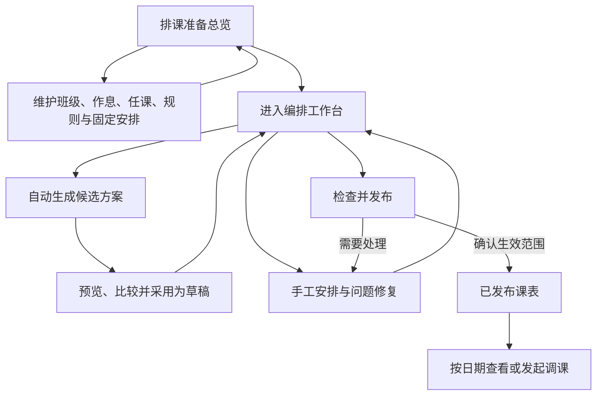

# 排课流程与页面交互改进计划

- 日期：2026-09-23
- 状态：批次 A 已实施；批次 B–E 待实施
- 代码基线：`044e5d2`（已推送至 `origin/main`）
- 本轮实现记录：[排课入口与页面职责](../implementation/scheduling-workflow-navigation.md)

## 1. 目标与现状

让教务人员能明确判断：资料在哪里维护、在哪里编排整学期课表、如何修正排课问题、修改何时生效，以及开学后的调课应该从哪里开始。

本轮改进同时覆盖菜单、排课流程和页面交互。准备总览中的功能卡片应进入实际功能页面，这些页面也应有稳定的菜单入口。

### 已有能力

- 查看已发布课表与编辑课表已有独立路由。
- 已有班级、年级、教师、教室视角，以及按日期和标准周查看。
- 已有排课准备检查、规则与固定安排、自动生成、候选对比和预览。
- 编辑课表已有移动、锁定、撤销、重做等能力。
- 发布已有完整性与影响检查；持续调课已有生效区间和临时调整衔接逻辑。
- 学期切换已放到工作台；课程配色和课表单元格样式已统一。

### 需要解决的问题

| 问题 | 当前表现 | 改进方向 |
| --- | --- | --- |
| 编号流程与实际操作不符 | 第一页“开始自动排课”只跳转生成页，看起来跳过了第二步 | 以稳定菜单组织功能；按钮准确说明下一步 |
| 准备总览职责混杂 | 功能入口、异常计数、理论容量和当前课表并列为卡片 | 卡片对应真实功能，统计和异常归入相关功能 |
| 编辑入口命名不准确 | 手工编排所在页面被归入“检查并发布” | 自动生成和手工编辑统一归入“编排课表” |
| 生成与调整操作分散 | 生成、选方案、继续编辑需要在不同页面间理解状态 | 围绕同一份草稿组织编排工作台 |
| 下一步处理不够直接 | “通过/提醒/阻塞”和数量不能充分表达具体处理任务 | 异常直接定位到资源、任课或规则 |
| 草稿与生效边界需要统一表达 | 采用方案、创建草稿和发布有多处入口 | 统一按钮语义、版本状态与发布确认 |

## 2. 官方案例依据

以下依据公开的官方帮助文档整理，借鉴业务流程和操作方式；未登录竞品账户实测，也不将旧文档截图当作其最新视觉设计。

| 产品与环节 | 官方文档中的做法 | 本项目采用的原则 |
| --- | --- | --- |
| TimeTabler：准备与编排 | 基础资料、教学任务、检查分析、编排分别组织；可沿用上一年资料；固定安排可以锁定 | 准备功能可反复维护，固定安排与自动排课衔接。[QuickStart Guide](https://www.timetabler.com/PDFs/QuickStartGuide.pdf) |
| WebUntis：规则设置 | 选择班级、教师、学科或教室，再在时间网格上指定要求与偏好 | 常用时间规则直接在时间网格操作。[Requirements for master data](https://help.untis.at/hc/en-150/articles/360009220300-Requirements-for-master-data) |
| aSc：检查和修复 | 检查失败后展示相关课表和无法放入的课程，继续定位教室等限制 | 检查结果应能带用户进入修复动作。[Checking and Fixing example](https://help.edupage.org/?lang_id=1&p=u1/u3/u59/t598) |
| WebUntis：编排 | 支持拖放或点选位置；区分不可用与不推荐位置；支持锁定和换教室 | 自动与手工编排在同一工作环境中衔接，操作前反馈可行性。[Manual scheduling](https://help.untis.at/hc/en-150/articles/360009298379-Manual-scheduling) |
| WebUntis / aSc：生成 | 从编排工具启动自动排课，完成后进入课表；生成过程提供求解信息 | 生成有明确状态、结果入口和后续动作。[Automatic scheduling](https://help.untis.at/hc/en-150/articles/360009224360-Automatic-scheduling)、[Generation progress](https://help.edupage.org/?lang_id=1&p=u1/u3/u58/t109) |
| aSc：保存和发布 | 保存未发布版本与更新正式课表分开，发布指定有效日期 | 保存草稿不等于生效；发布集中核对影响。[Saving changes](https://help.edupage.org/?id=u1054&lang_id=1)、[Publishing](https://help.edupage.org/?id=t886&lang_id=1) |
| aSc：开学后调整 | 临时变化使用代课模块；固定课表变化另存并按日期发布 | 单次调课与持续调整分别表达生效范围。[Changes during the school year](https://help.edupage.org/?lang_id=1&p=u3/u343/u3040) |

后续页面方案是结合本项目已有能力作出的设计建议，不表示竞品采用完全相同的菜单或布局。不直接照搬竞品允许覆盖历史发布区间的操作。

## 3. 页面与菜单职责

建议保留“查看课表、学期排课、调课与代课”三个业务入口，在“学期排课”下提供稳定子菜单。

```text
教务工作
├─ 查看课表
├─ 学期排课
│  ├─ 排课准备
│  ├─ 班级与作息
│  ├─ 任课与课时
│  ├─ 排课规则
│  ├─ 固定安排
│  └─ 编排课表
└─ 调课与代课
   ├─ 单次调课
   ├─ 持续调课
   └─ 请假与代课
```

- 移除学期排课页面上方常驻的四步编号导航。
- 准备卡片、侧栏菜单、面包屑使用一致名称和目标路由。
- 班级与作息页面内部可按内容组织班级和作息；准备总览不再增加一层重复功能页签。
- “固定安排”有独立页面入口，可以复用已有编辑组件和接口。
- “检查并发布”作为编排工作台中的操作，打开统一的发布核对界面，不再用它命名整个编辑页面。
- 普通查看权限不获得编排、生成或发布权限；菜单可见性和路由权限继续使用已有权限体系。

### 路由迁移建议

下表中路径均相对于 `/semesters/:semesterId`。批次 A 已完成固定安排路由和旧地址兼容，其余工作台整合按后续批次实施。

| 功能 | 当前入口 | 建议处理 |
| --- | --- | --- |
| 排课准备 | `/preparation` | 保留路由，统一名称 |
| 班级与作息 | `/setup` | 保留路由，保留有效的内部定位参数 |
| 任课与课时 | `/assignments` | 保留路由，支持异常记录定位 |
| 排课规则 | `/constraints` | 保留规则入口，固定安排迁到独立入口 |
| 固定安排 | `/constraints?tab=fixed` | 新增 `/fixed-placements`；旧地址兼容跳转 |
| 编排课表 | `/planning` | 作为统一编排工作台入口 |
| 自动生成 | `/generate` | 整合后仍兼容旧链接、任务详情和候选深链接 |
| 查看课表 | `/timetable` | 保持正式课表查看职责 |

迁移时保留学期、草稿/版本、任务、视角及对象参数，不把旧链接一律重定向到首页。具体参数沿用现有定义，新增参数集中到路由辅助函数。

## 4. 完整操作流程



准备维护和手工调整允许反复返回。首次使用时可以给出下一项待办；已有资料或草稿时直接进入对应功能，不强制重复经过完整向导。

## 5. 页面交互方案

### 5.1 排课准备总览

功能卡片调整为“班级与作息、任课与课时、排课规则、固定安排”。每张卡片都有可用的维护页面。

- 卡片展示摘要和具体问题，如“360 条任课 · 2 个班级课时未配齐”；示例数字仅用于说明展示格式。
- 点击卡片主体进入完整功能页面；点击异常入口进入相应异常记录或定位区域，避免嵌套交互控件。
- 理论容量、资源异常归入班级作息或任课页面的检查信息，不作为独立业务页面。
- 固定安排为零时显示“未设置”；只有实际检查发现问题时才报异常，不要求用户为完成流程而添加规则。
- 当前草稿和已发布课表通过“继续编排”“查看已发布课表”提供入口，不与准备事项混为同类卡片。
- 主按钮为“进入编排”或“继续编排”。允许进入工作台查看与修复；阻塞条件在实际生成、采用和发布时按各自规则检查。
- “重新检查”直接执行只读检查，取消二次确认和人为等待时间；加载反馈根据真实请求显示。
- 修改相关资料后刷新对应检查结果。失败时保留旧结果但标明未更新，不把失败或未知显示为通过。
- 从维护页返回时保留总览和列表上下文。复杂编辑页面有明确保存状态，离开未保存内容时才提示。

### 5.2 排课规则与固定安排

| 用户任务 | 页面操作 | 反馈 |
| --- | --- | --- |
| 指定教师不可用时间 | 选择教师，在星期/课节网格上点选或拖选 | 显示选定时段；提供清除操作 |
| 指定课程时间偏好 | 选择课程、时间范围及偏好 | 清楚标注“必须满足”或“尽量满足” |
| 固定班会等安排 | 选择任课任务和课节位置 | 显示教师、教室、班级冲突及固定状态 |
| 修改已有规则 | 从规则列表或问题详情进入编辑 | 保存后刷新相关检查 |

- 教师、班级和教室不得重叠等系统基础约束默认执行，无需用户逐条配置。
- 复杂规则继续保留表单；网格只覆盖适合按时间表达的规则。
- 前端展示的规则强度必须与后端约束模型对应，不能只改标签。
- 固定安排复用现有业务语义，实施前确认其与课节锁定的关系；锁定标识和自动排课设置保持一致。
- 冲突说明包含对象、时间和相关规则，提供定位入口；避免只显示“规则冲突”。

### 5.3 编排工作台

以课表为主要工作区域，整合已有自动排课、草稿编辑、检查和发布能力。

**顶部工具区**：当前草稿/方案、班级/年级/教师/教室视角、对象选择、撤销/重做、自动排课、检查并发布。高频筛选与课表保持紧凑布局，次要操作按需展开。

**待排课程区**：展示课程、班级、教师，以及应排/已排/剩余课时。支持搜索和对象筛选，可收起；小屏按需展开，避免压缩课表到不可读。

**问题区**：默认显示问题数量，按需展开未排、硬冲突、偏好提醒；点击问题定位课程、课格或来源配置。只有需要诊断时展开，不增加常驻说明条。

**课程操作**：

1. 选中待排课程，展示可安排位置及限制。
2. 支持拖动，也支持“选课程 → 点目标格”；键盘用户有等价入口。
3. 可用、不可用和不推荐状态有文字或图标反馈，不能仅靠颜色区分。
4. 点击已排课程使用居中弹窗，提供移动、交换、换教室、锁定等已有授权操作。
5. 交换时清楚展示双方去向；涉及多节课时先展示影响范围。
6. 保存成功后更新课表、待排数量和诊断；失败保留操作上下文并说明原因。
7. 允许撤销的操作进入现有撤销/重做记录。切换视角不应丢失正在处理的对象。

目标位置可行性以服务器校验为准。前端可先提示已知的占用，涉及复杂规则的原因和替代位置需要评估现有接口能力，不能用假数据补全。

### 5.4 自动生成与结果处理

- 从编排工作台点击“自动排课”打开设置，确认后点击“开始生成”才创建任务。
- 默认展示常用选项：排课范围、重排或补齐、是否保留锁定。策略和候选数量等进阶配置按需展开。
- 复用已有后台任务、轮询、取消、候选预览和对比机制；用户离开页面后再次打开能找回任务。
- 展示接口实际提供的阶段、耗时和结果数据。没有实时已排数量或剩余时间时，不虚构百分比和倒计时。
- 失败后保留本次参数，并提供“查看原因”“修改相关资料/规则”“重新生成”等可执行入口。
- 未找到完整方案不能一律表述为“规则无解”；只有有证据的阻塞原因才作确定性说明。
- 对比优先展示可采用性、未排、硬冲突和主要质量差异，详细评分按需查看。
- “采用并继续编辑”将候选复制为编辑草稿；不因选择候选或普通保存自动发布。
- 保留当前后端的采用条件。部分候选接入编辑、自动放宽规则等新能力单独评估，不在界面整合时放宽校验。
- 从候选直接发起发布时，也必须经过与编辑草稿一致的发布核对流程。

### 5.5 版本与发布

用户可见状态统一为“编辑草稿、已发布课表、历史版本”。候选方案属于生成结果，不混入日常查看的版本列表。

| 操作 | 结果 |
| --- | --- |
| 保存/自动保存草稿 | 保存编辑内容，不改变正式课表 |
| 采用候选 | 创建或明确选择编辑草稿；已有未完成草稿时说明处理方式 |
| 检查并发布 | 核对完整性、硬冲突、规则变化和已有调课影响 |
| 确认发布 | 按后端支持的生效范围安装正式课表并保留历史 |
| 从历史版本恢复编辑 | 创建草稿，再检查和发布；不直接覆盖历史执行记录 |

- 发布核对集中展示版本、适用学期/生效范围、主要变化和必须处理的问题。
- 复用已有临时调课、代课衔接检查和并发保护，不绕过 `If-Match` 等校验。
- 对当前生效区间能力先核对契约；需要新增的发布日期选择应作为前后端共同任务，不能只加日期控件。
- 存在多个有效区间时，“已发布”不等于“今天正在执行”。界面应按查看日期标明实际生效课表。
- 发布失败保留草稿与核对上下文。并发变更明确提示重新获取和检查，不能静默覆盖。
- 历史恢复的具体范围以服务端能力为准；优先恢复为草稿，不追溯改变过去实际课程。

### 5.6 日常调课与查看课表

- 从按日期课表中的课程详情发起调课时，自动带入学期、日期、原课、班级、教师和教室。
- 单次调课处理指定日期；持续调课处理指定日期起的固定安排；请假与代课围绕缺席和受影响课程组织。
- 标准周没有具体执行日期，发起单次调课前必须明确日期，不能暗中使用今天。
- 沿用“选择原课 → 设置新安排 → 核对 → 发布”流程，返回修改时保留已选对象和新安排。
- 持续调课沿用按字段、按区间的现有逻辑，避免为少量调整要求用户管理整份版本。
- 正式课表查看默认保持只读。编辑草稿中的移动与正式执行期间的调课使用不同操作文案。
- 继续复用已统一的列表骨架：筛选和表头一体，功能按钮放在筛选右侧。

## 6. 保留已经确认的界面方向

- 课表统一使用浅色填满单元格；不恢复内嵌圆角课程卡片和左侧彩色高亮边。
- 视角顺序保持“班级、年级、教师、教室”。
- 年级视图按单日查看，不恢复“整周总览”和学科图例筛选。
- 课程详情使用弹窗；不恢复年级课程详情抽屉。
- 不恢复重复页面大标题、常驻解释文字和已经移除的多余筛选。
- 学期切换保留在首页/工作台，功能页面根据路由继承学期；不重新放回全局头部。
- 不恢复补课创建入口和写入能力；历史兼容数据的处理沿用现有边界。
- 不新增调课审批环节。不同权限、保存状态和真实风险有必要反馈，其余操作避免无意义确认。

## 7. 分批实施顺序

| 批次 | 优先级 | 工作内容 | 依赖与范围 | 状态 |
| --- | --- | --- | --- | --- |
| A：入口和职责 | P0 | 移除误导性步骤条；准备卡片对应真实页面；提供同名菜单；修正按钮文案；固定安排独立入口；兼容旧路由 | 以页面、路由和组件复用为主，不改求解器 | 已实施 |
| B：连续编排 | P1 | 以 `/planning` 为工作台，整合生成入口、候选采用、待排课程和问题定位；保留草稿、视角和返回状态 | 基于 A；复用已有编辑、生成及诊断能力 | 待实施 |
| C：状态与发布统一 | P1 | 草稿/正式/历史语义统一；统一发布核对；明确生效范围；核实候选和编辑草稿入口行为一致 | 与 B 配合；核对发布契约及已有调课迁移逻辑 | 待实施 |
| D：规则和落位反馈 | P2 | 常用时间规则网格；选课后显示可放位置；具体冲突原因与规则定位 | 先盘点可用校验接口，缺少结构化原因时补充契约与 API | 待实施 |
| E：日常操作衔接 | P2 | 从实际课程直接发起调课；带入上下文；统一调整结果返回与查看 | 复用现有单次、持续调课和请假代课流程 | 待实施 |

第一批交付边界是 A：用户能从准备卡片和菜单进入同一个真实功能页面；进入编排不再呈现“跳过第二步”的错觉。后续批次逐步增加交互能力，避免一次同时改导航、求解策略和发布数据模型。

### 主要涉及文件

| 范围 | 现有文件/目录 |
| --- | --- |
| 路由、菜单和面包屑 | `apps/web/src/App.tsx`、`apps/web/src/components/app-navigation.ts`、`apps/web/src/components/app-sidebar.tsx`、`apps/web/src/components/workspace-shell.tsx`、`apps/web/src/lib/semester.ts` |
| 准备入口与旧步骤导航 | `apps/web/src/pages/preparation-check-page.tsx`、`apps/web/src/components/scheduling-workflow.tsx` |
| 班级作息、任课、规则 | `apps/web/src/pages/semester-setup-page.tsx`、`apps/web/src/components/assignment-editor.tsx`、`apps/web/src/pages/scheduling-constraints-page.tsx` |
| 编排与候选 | `apps/web/src/pages/timetable-page.tsx`、`apps/web/src/pages/schedule-generation-page.tsx`、`apps/web/src/components/timetable-grid.tsx`、`apps/web/src/components/grade-timetable.tsx` |
| 发布与查看 | `apps/web/src/components/publish-timetable-dialog.tsx`、`apps/web/src/pages/published-timetable-page.tsx` |
| 调课 | `apps/web/src/components/adjustments/`、`apps/web/src/components/daily-adjustments/`、`apps/web/src/components/long-term-changes/` |
| 服务端与契约（按需） | `apps/api/app/Modules/Scheduling/`、`apps/api/app/Modules/Timetable/`、`apps/api/app/Modules/DailyOperations/`、`contracts/openapi.yaml`、`packages/api-client/src/generated-types.ts` |

## 8. 后续验收清单

以下是整轮改进的验收要求；未勾选项仍需在后续实施或验收中确认。本轮只完成批次 A，核对范围见实现记录，按用户要求未运行测试。

- [x] 准备卡片、菜单和面包屑同名同目标；每张功能卡片打开可实际维护的页面。
- [ ] 页面刷新、浏览器前进后退和旧地址访问保留正确学期与必要上下文。
- [ ] “进入编排”只进入工作台；只有“开始生成”才创建任务；没有误导性的编号跳步。
- [ ] 有资料问题时仍可进入对应功能修复；实际生成、采用、发布遵守各自后端条件。
- [ ] 修改准备资料后检查状态更新；请求失败不会显示零问题或通过。
- [x] 无固定安排的学校能正常准备排课，不因零条记录被人为阻塞。
- [ ] 候选预览、采用、继续编辑之间保留方案身份；未发布修改不影响正式课表。
- [ ] 手工移动、交换、锁定、撤销后课表与诊断一致；冲突失败保留用户上下文。
- [ ] 规则/目标位置反馈与服务端结果一致；没有接口能力时不展示虚构原因或进度。
- [ ] 发布明确生效范围，并保留已有临时调课与代课迁移、并发和历史保护。
- [ ] 从按日期课表发起调课带入正确原课；从标准周发起单次调课时明确选择日期。
- [ ] 窄屏可用，弹窗焦点可返回触发点，关键操作可用键盘完成，颜色不是唯一状态信息。
- [ ] 已确认的满格配色、弹窗详情、精简标题与说明、统一列表边距保持一致。

## 9. 文档与实现同步

每完成一个批次，在实现说明中记录页面行为和契约变化，并更新相关需求文档。特别核对已有年级视图、调课说明中保留的旧筛选或补课描述，区分历史记录与当前行为。本文作为下一阶段工作清单，不以它覆盖现有服务端业务约束。
